# APIシーケンス図

> 技術仕様: [tech_spec.md §5,§7](docs/tech/tech_spec.md)

## 1. 初回アクセス（ゲスト作成 — Phase 1）

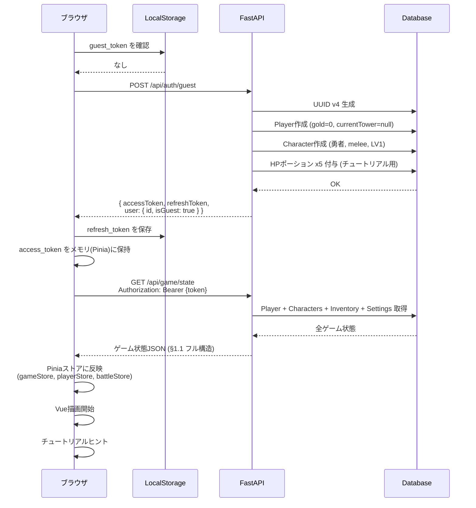

## 2. 再訪問（オフライン復帰）

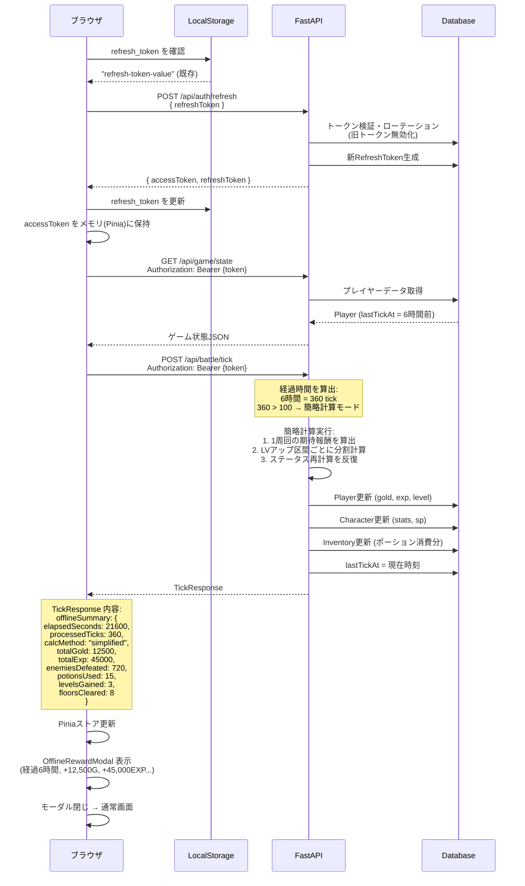

## 3. オンライン中（ポーリングループ）

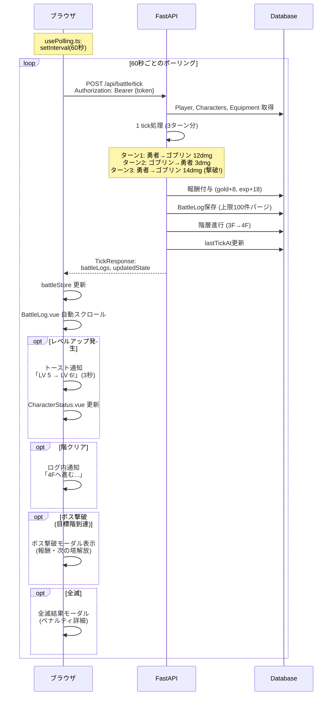

## 4. 塔選択フロー

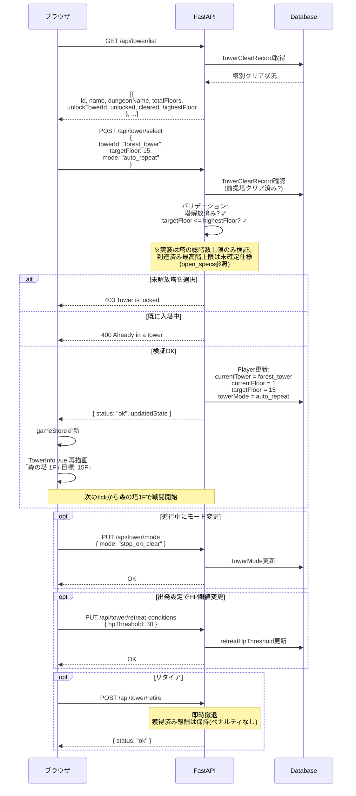

## 5. ショップ購入フロー

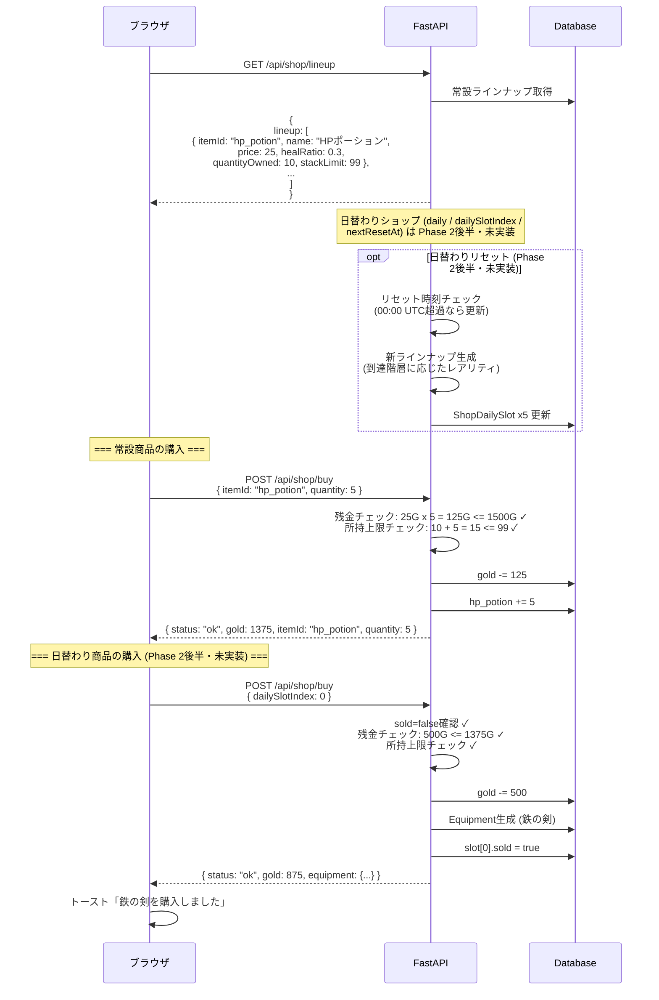

## 6. 装備変更フロー

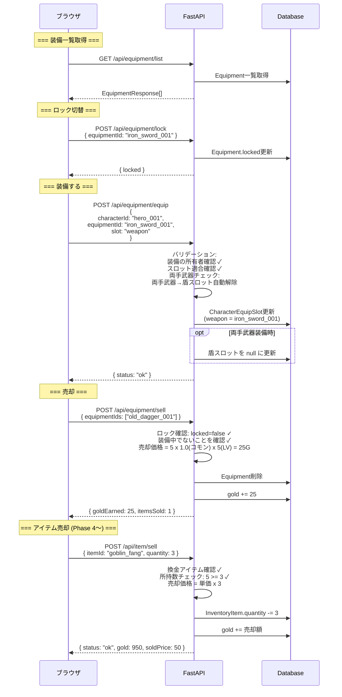

## 7. スキル習得・リセットフロー（Phase 3）

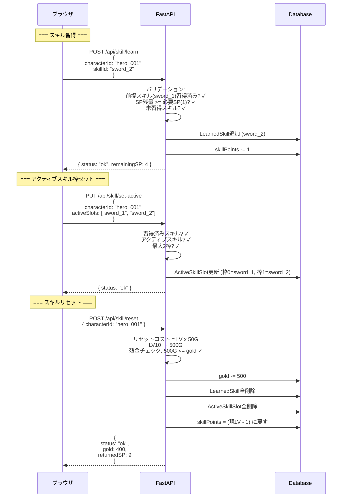

## 8. 限界突破フロー（Phase 3）

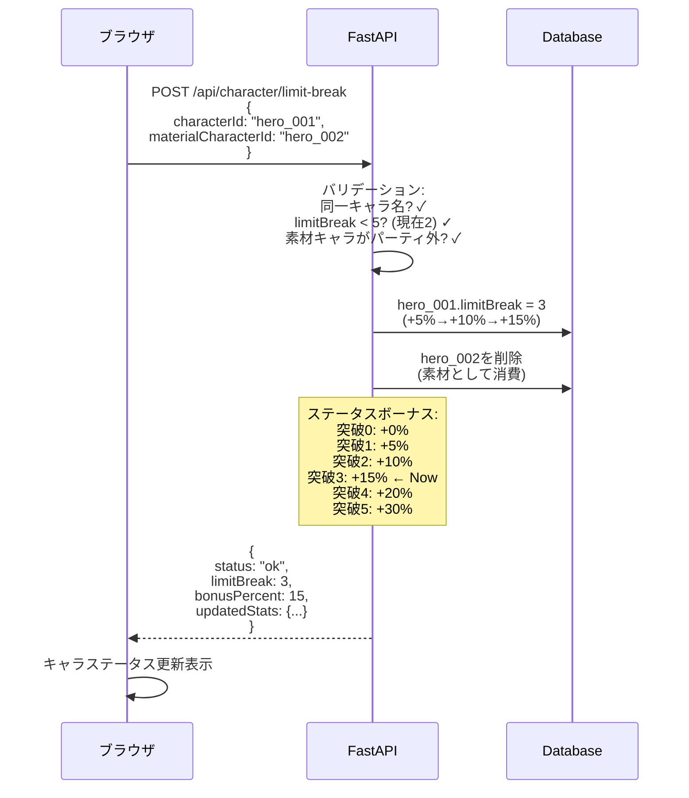

## 9. 施設建設・レベルアップ（Phase 4）

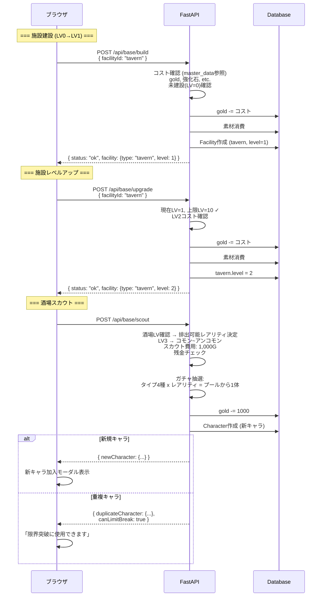

## 10. 鍛冶屋操作フロー（Phase 4）

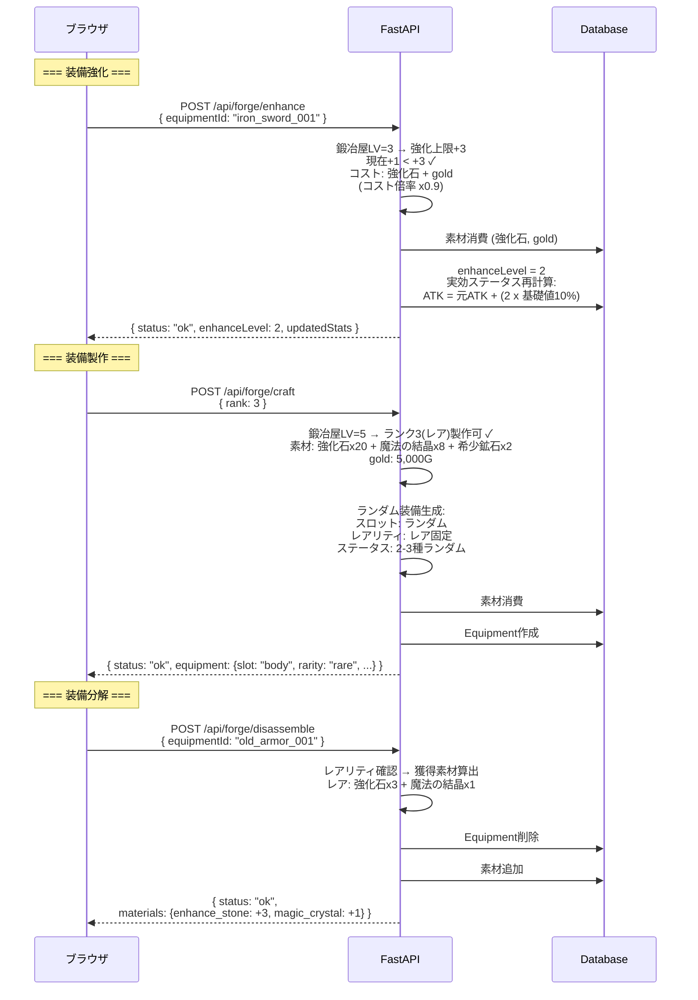

## 11. ボスラッシュフロー（Phase 5）

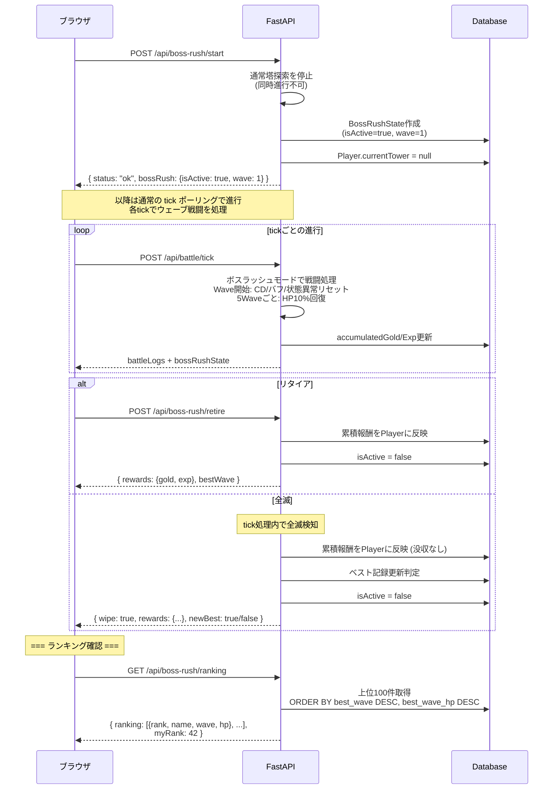

## 11.5. イベントダンジョンフロー（Phase 5）

> イベントダンジョン（試練の迷宮・宝物庫・修練場）は通常の塔と同じデータ構造で管理される。
> 難易度（初級/中級/上級）は `Modifier`（bonus型: 報酬倍率 ×1/2/4）で実装し、
> 塔選択API `/api/tower/select` で同一のフローを使用する。
> 専用APIエンドポイントは不要。

## 12. 転生フロー（Phase 5）

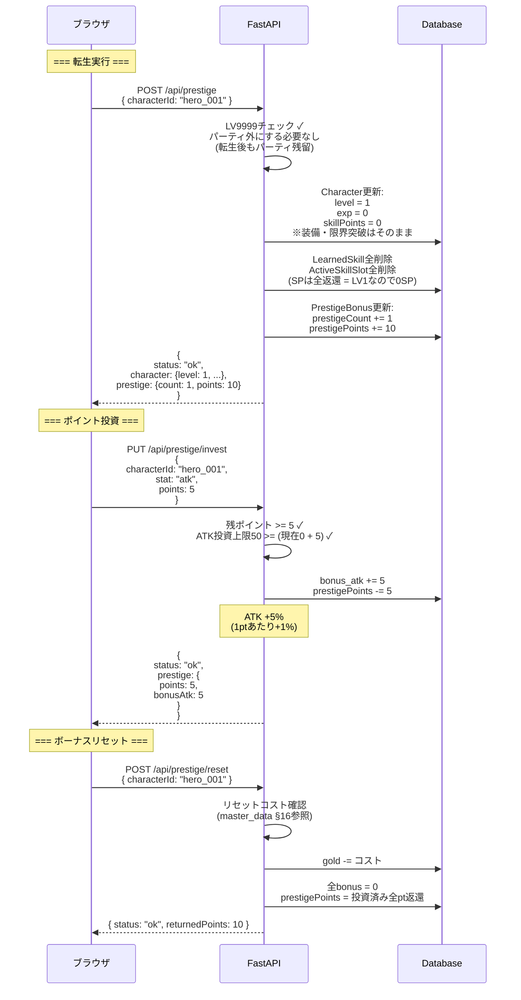

## 13. 通信エラー時（リトライ）

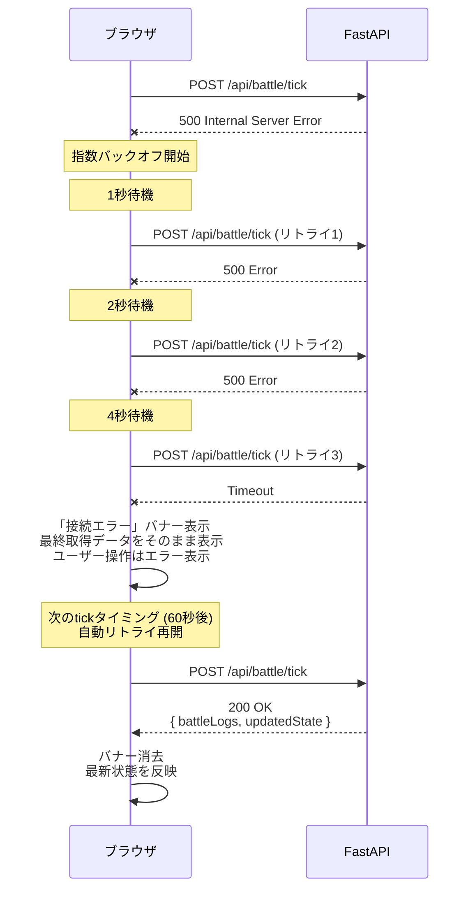

## 14. 認証フロー概要（Phase 2〜）

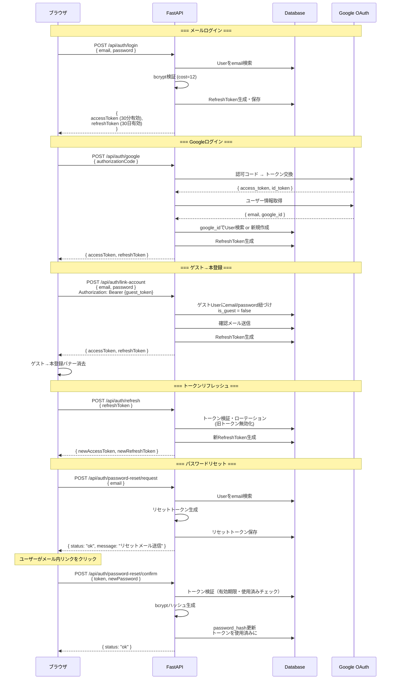
