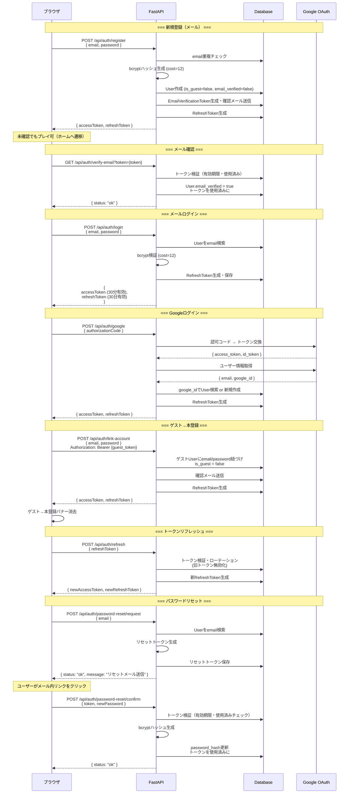

# APIシーケンス図 — 認証（Phase 2〜）

> 親: [api_sequence.md](../api_sequence.md)。認証仕様は [tech_auth.md](../../docs/tech/tech_auth.md)。

## 14. 認証フロー概要（Phase 2〜）

```mermaid
%%{init: {'theme': 'default', 'sequence': {'actorFontSize': 18, 'messageFontSize': 16, 'noteFontSize': 14}} }%%
sequenceDiagram
    participant B as ブラウザ
    participant API as FastAPI
    participant DB as Database
    participant Google as Google OAuth

    Note over B,Google: === 新規登録（メール） ===

    B->>API: POST /api/auth/register<br/>{ email, password }
    API->>DB: email重複チェック
    API->>API: bcryptハッシュ生成 (cost=12)
    API->>DB: User作成 (is_guest=false, email_verified=false)
    API->>DB: EmailVerificationToken生成・確認メール送信
    API->>DB: RefreshToken生成
    API-->>B: { accessToken, refreshToken }
    Note over B: 未確認でもプレイ可（ホームへ遷移）

    Note over B,Google: === メール確認 ===

    B->>API: GET /api/auth/verify-email?token={token}
    API->>DB: トークン検証（有効期限・使用済み）
    API->>DB: User.email_verified = true<br/>トークンを使用済みに
    API-->>B: { status: "ok" }

    Note over B,Google: === メールログイン ===

    B->>API: POST /api/auth/login<br/>{ email, password }
    API->>DB: Userをemail検索
    API->>API: bcrypt検証 (cost=12)
    API->>DB: RefreshToken生成・保存
    API-->>B: {<br/>  accessToken (30分有効),<br/>  refreshToken (30日有効)<br/>}

    Note over B,Google: === Googleログイン ===

    B->>API: POST /api/auth/google<br/>{ authorizationCode }
    API->>Google: 認可コード → トークン交換
    Google-->>API: { access_token, id_token }
    API->>Google: ユーザー情報取得
    Google-->>API: { email, google_id }
    API->>DB: google_idでUser検索 or 新規作成
    API->>DB: RefreshToken生成
    API-->>B: { accessToken, refreshToken }

    Note over B,Google: === ゲスト→本登録 ===

    B->>API: POST /api/auth/link-account<br/>{ email, password }<br/>Authorization: Bearer {guest_token}
    API->>DB: ゲストUserにemail/password紐づけ<br/>is_guest = false
    API->>DB: 確認メール送信
    API->>DB: RefreshToken生成
    API-->>B: { accessToken, refreshToken }
    B->>B: ゲスト→本登録バナー消去

    Note over B,Google: === トークンリフレッシュ ===

    B->>API: POST /api/auth/refresh<br/>{ refreshToken }
    API->>DB: トークン検証・ローテーション<br/>(旧トークン無効化)
    API->>DB: 新RefreshToken生成
    API-->>B: { newAccessToken, newRefreshToken }

    Note over B,Google: === パスワードリセット ===

    B->>API: POST /api/auth/password-reset/request<br/>{ email }
    API->>DB: Userをemail検索
    API->>API: リセットトークン生成
    API->>DB: リセットトークン保存
    API-->>B: { status: "ok", message: "リセットメール送信" }

    Note over B: ユーザーがメール内リンクをクリック

    B->>API: POST /api/auth/password-reset/confirm<br/>{ token, newPassword }
    API->>DB: トークン検証（有効期限・使用済みチェック）
    API->>API: bcryptハッシュ生成
    API->>DB: password_hash更新<br/>トークンを使用済みに
    API-->>B: { status: "ok" }
```
