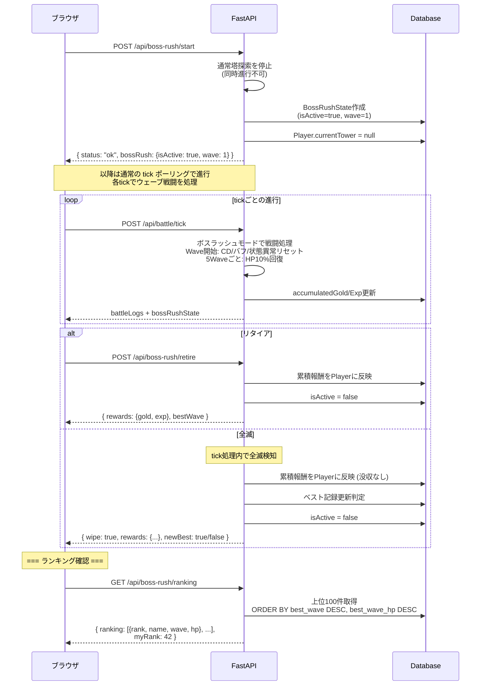
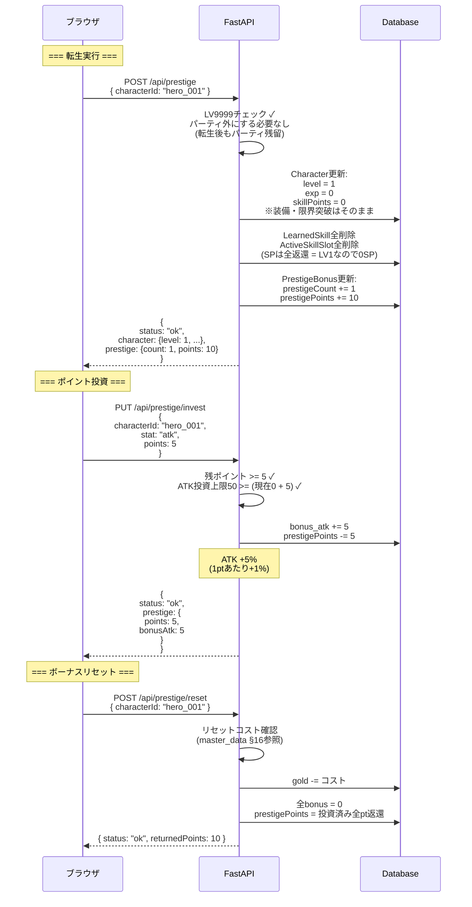

# APIシーケンス図 — ボスラッシュ・転生（Phase 5）

> 親: [api_sequence.md](../api_sequence.md)。API定義は [tech_api.md](../../docs/tech/tech_api.md)。

## 11. ボスラッシュフロー（Phase 5）

## 11.5. イベントダンジョンフロー（Phase 5）

> イベントダンジョン（試練の迷宮・宝物庫・修練場）は通常の塔と同じデータ構造で管理される。
> 難易度（初級/中級/上級）は `Modifier`（bonus型: 報酬倍率 ×1/2/4）で実装し、
> 塔選択API `/api/tower/select` で同一のフローを使用する。
> 専用APIエンドポイントは不要。

## 12. 転生フロー（Phase 5）

