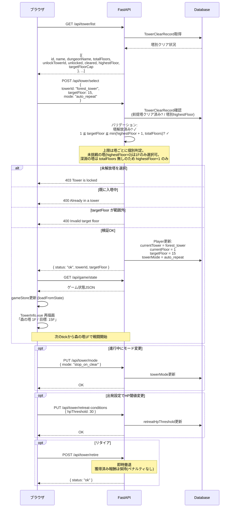
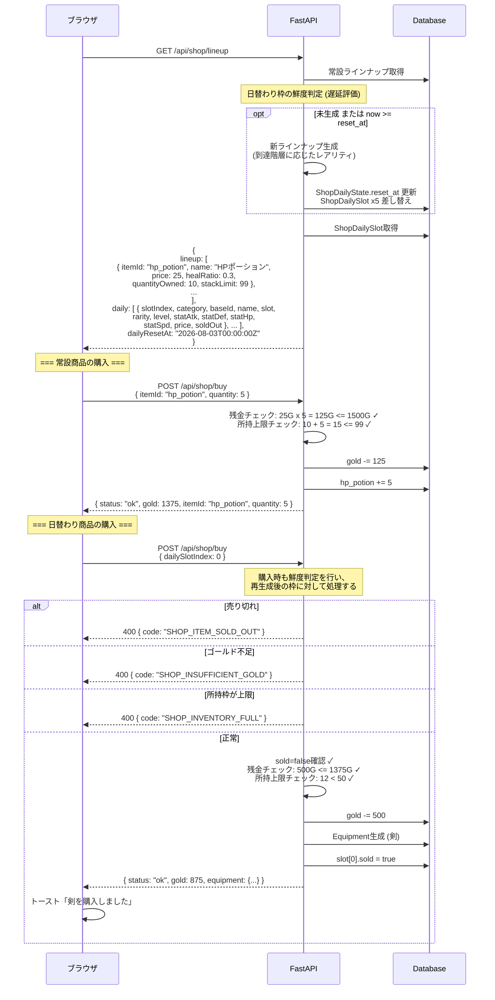
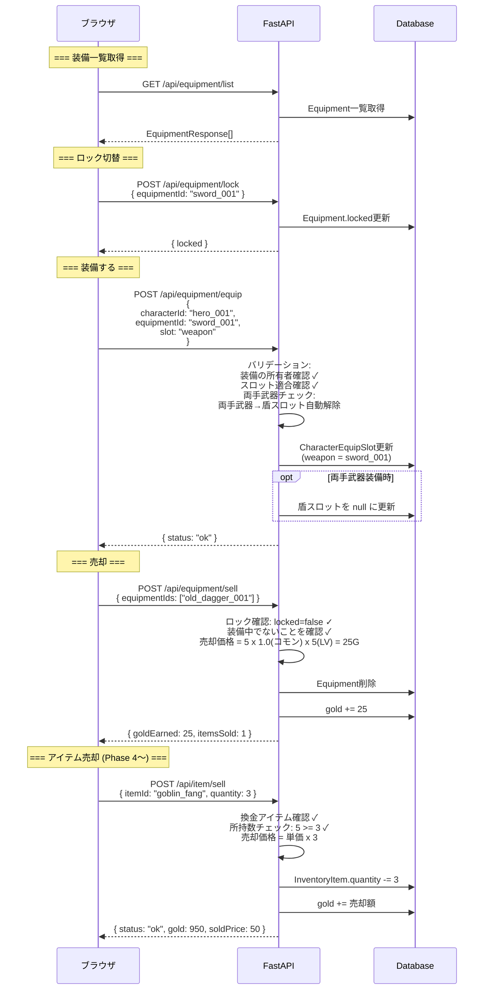

# APIシーケンス図 — 塔・ショップ・装備

> 親: [api_sequence.md](../api_sequence.md)。API定義は [tech_api.md](../../docs/tech/basic/tech_api.md)。

## 4. 塔選択フロー

```mermaid
%%{init: {'theme': 'default', 'sequence': {'actorFontSize': 18, 'messageFontSize': 16, 'noteFontSize': 14}} }%%
sequenceDiagram
    participant B as ブラウザ
    participant API as FastAPI
    participant DB as Database

    B->>API: GET /api/tower/list
    API->>DB: TowerClearRecord取得
    DB-->>API: 塔別クリア状況
    API-->>B: [{<br/>  id, name, dungeonName, totalFloors,<br/>  unlockTowerId, unlocked, cleared, highestFloor,<br/>  targetFloorCap<br/>}, ...]

    B->>API: POST /api/tower/select<br/>{<br/>  towerId: "forest_tower",<br/>  targetFloor: 15,<br/>  mode: "auto_repeat"<br/>}

    API->>DB: TowerClearRecord確認<br/>(前提塔クリア済み? / 塔別highestFloor)
    API->>API: バリデーション:<br/>塔解放済み? ✓<br/>1 ≦ targetFloor ≦ min(highestFloor + 1, totalFloors)? ✓

    Note over API: 上限は塔ごとに個別判定。<br/>未挑戦の塔(highestFloor=0)は1Fのみ選択可。<br/>深淵の塔は totalFloors 無しのため highestFloor+1 のみ

    alt 未解放塔を選択
        API-->>B: 403 Tower is locked
    else 既に入塔中
        API-->>B: 400 Already in a tower
    else targetFloor が範囲外
        API-->>B: 400 Invalid target floor
    else 検証OK
        API->>DB: Player更新:<br/>currentTower = forest_tower<br/>currentFloor = 1<br/>targetFloor = 15<br/>towerMode = auto_repeat

        API-->>B: { status: "ok", towerId, targetFloor }

        B->>API: GET /api/game/state
        API-->>B: ゲーム状態JSON
        B->>B: gameStore更新 (loadFromState)
        B->>B: TowerInfo.vue 再描画<br/>「森の塔 1F / 目標: 15F」

        Note over B,API: 次のtickから森の塔1Fで戦闘開始
    end

    opt 進行中にモード変更
        B->>API: PUT /api/tower/mode<br/>{ mode: "stop_on_clear" }
        API->>DB: towerMode更新
        API-->>B: OK
    end

    opt 出発設定でHP閾値変更
        B->>API: PUT /api/tower/retreat-conditions<br/>{ hpThreshold: 30 }
        API->>DB: retreatHpThreshold更新
        API-->>B: OK
    end

    opt リタイア
        B->>API: POST /api/tower/retire
        Note over API: 即時撤退<br/>獲得済み報酬は保持(ペナルティなし)
        API-->>B: { status: "ok" }
    end
```

## 5. ショップ購入フロー

```mermaid
%%{init: {'theme': 'default', 'sequence': {'actorFontSize': 18, 'messageFontSize': 16, 'noteFontSize': 14}} }%%
sequenceDiagram
    participant B as ブラウザ
    participant API as FastAPI
    participant DB as Database

    B->>API: GET /api/shop/lineup
    API->>DB: 常設ラインナップ取得

    Note over API: 日替わり枠の鮮度判定 (遅延評価)

    opt 未生成 または now >= reset_at
        API->>API: 新ラインナップ生成<br/>(到達階層に応じたレアリティ)
        API->>DB: ShopDailyState.reset_at 更新<br/>ShopDailySlot x5 差し替え
    end

    API->>DB: ShopDailySlot取得
    API-->>B: {<br/>  lineup: [<br/>    { itemId: "hp_potion", name: "HPポーション",<br/>      price: 25, healRatio: 0.3,<br/>      quantityOwned: 10, stackLimit: 99 },<br/>    ...<br/>  ],<br/>  daily: [ { slotIndex, category, baseId, name, slot,<br/>    rarity, level, statAtk, statDef, statHp,<br/>    statSpd, price, soldOut }, ... ],<br/>  dailyResetAt: "2026-08-03T00:00:00Z"<br/>}

    Note over B: === 常設商品の購入 ===

    B->>API: POST /api/shop/buy<br/>{ itemId: "hp_potion", quantity: 5 }
    API->>API: 残金チェック: 25G x 5 = 125G <= 1500G ✓<br/>所持上限チェック: 10 + 5 = 15 <= 99 ✓
    API->>DB: gold -= 125
    API->>DB: hp_potion += 5
    API-->>B: { status: "ok", gold: 1375, itemId: "hp_potion", quantity: 5 }

    Note over B: === 日替わり商品の購入 ===

    B->>API: POST /api/shop/buy<br/>{ dailySlotIndex: 0 }
    Note over API: 購入時も鮮度判定を行い、<br/>再生成後の枠に対して処理する

    alt 売り切れ
        API-->>B: 400 { code: "SHOP_ITEM_SOLD_OUT" }
    else ゴールド不足
        API-->>B: 400 { code: "SHOP_INSUFFICIENT_GOLD" }
    else 所持枠が上限
        API-->>B: 400 { code: "SHOP_INVENTORY_FULL" }
    else 正常
        API->>API: sold=false確認 ✓<br/>残金チェック: 500G <= 1375G ✓<br/>所持上限チェック: 12 < 50 ✓
        API->>DB: gold -= 500
        API->>DB: Equipment生成 (剣)
        API->>DB: slot[0].sold = true
        API-->>B: { status: "ok", gold: 875, equipment: {...} }
        B->>B: トースト「剣を購入しました」
    end
```

## 6. 装備変更フロー

```mermaid
%%{init: {'theme': 'default', 'sequence': {'actorFontSize': 18, 'messageFontSize': 16, 'noteFontSize': 14}} }%%
sequenceDiagram
    participant B as ブラウザ
    participant API as FastAPI
    participant DB as Database

    Note over B: === 装備一覧取得 ===

    B->>API: GET /api/equipment/list
    API->>DB: Equipment一覧取得
    API-->>B: EquipmentResponse[]

    Note over B: === ロック切替 ===

    B->>API: POST /api/equipment/lock<br/>{ equipmentId: "sword_001" }
    API->>DB: Equipment.locked更新
    API-->>B: { locked }

    Note over B: === 装備する ===

    B->>API: POST /api/equipment/equip<br/>{<br/>  characterId: "hero_001",<br/>  equipmentId: "sword_001",<br/>  slot: "weapon"<br/>}

    API->>API: バリデーション:<br/>装備の所有者確認 ✓<br/>スロット適合確認 ✓<br/>両手武器チェック:<br/>  両手武器→盾スロット自動解除

    API->>DB: CharacterEquipSlot更新<br/>(weapon = sword_001)

    opt 両手武器装備時
        API->>DB: 盾スロットを null に更新
    end

    API-->>B: { status: "ok" }

    Note over B: === 売却 ===

    B->>API: POST /api/equipment/sell<br/>{ equipmentIds: ["old_dagger_001"] }
    API->>API: ロック確認: locked=false ✓<br/>装備中でないことを確認 ✓<br/>売却価格 = 5 x 1.0(コモン) x 5(LV) = 25G
    API->>DB: Equipment削除
    API->>DB: gold += 25
    API-->>B: { goldEarned: 25, itemsSold: 1 }

    Note over B: === アイテム売却 (Phase 4〜) ===

    B->>API: POST /api/item/sell<br/>{ itemId: "goblin_fang", quantity: 3 }
    API->>API: 換金アイテム確認 ✓<br/>所持数チェック: 5 >= 3 ✓<br/>売却価格 = 単価 x 3
    API->>DB: InventoryItem.quantity -= 3
    API->>DB: gold += 売却額
    API-->>B: { status: "ok", gold: 950, soldPrice: 50 }
```
