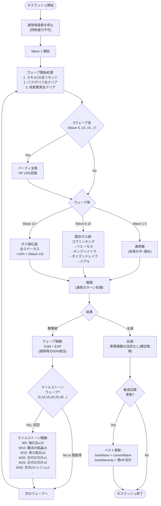

# 戦闘フロー — ボスラッシュ ウェーブ処理

> 親: [battle_flow.md](../battle_flow.md)。仕様は [systems/endgame.md](../../docs/design/systems/endgame.md)。

## ボスラッシュ ウェーブ処理フロー

```mermaid
%%{init: {'theme': 'default', 'themeVariables': {'fontSize': '16px'}} }%%
flowchart TD
    Start([ボスラッシュ開始]) --> StopTower["通常塔探索を停止\n(同時進行不可)"]
    StopTower --> InitWave["Wave 1 開始"]

    InitWave --> WaveSetup["ウェーブ開始処理:\n1. スキルCD全リセット\n2. バフ/デバフ全クリア\n3. 状態異常全クリア"]

    WaveSetup --> HpRecovery{"5ウェーブ目\n(Wave 5, 10, 15...)?\n"}
    HpRecovery -->|Yes| Heal10["パーティ全員\nHP 10%回復"]
    HpRecovery -->|No| DetermineEnemy
    Heal10 --> DetermineEnemy

    DetermineEnemy{"ウェーブ帯"}
    DetermineEnemy -->|Wave 1-5| NormalEnemy["通常敵\n(各塔の中~強め)"]
    DetermineEnemy -->|Wave 6-10| BossEnemy["既存ボス順:\nゴブリンキング\n→ベヒーモス\n→キングハイドラ\n→ポイズンドレイク\n→バアル"]
    DetermineEnemy -->|Wave 11+| ScaledBoss["ボス強化版:\n全ステータス\n+10% × (Wave-10)"]

    NormalEnemy --> Battle["戦闘\n(通常のターン処理)"]
    BossEnemy --> Battle
    ScaledBoss --> Battle

    Battle --> WaveResult{"結果"}
    WaveResult -->|敵撃破| WaveReward["ウェーブ報酬:\nGold + EXP\n(通常塔の50%相当)"]
    WaveResult -->|全滅| Wipe

    WaveReward --> Milestone{"マイルストーン\nウェーブ?\n(5,10,15,20,25,30...)"}
    Milestone -->|Yes, 初回| MilestoneReward["マイルストーン報酬:\nW5: 強化石x10\nW10: 魔法の結晶x5\nW15: 希少鉱石x3\nW20: 古代の欠片x1\nW25: 古代の欠片x2\nW30: 古代x3+レジェx1\n..."]
    Milestone -->|No or 既取得| NextWave["次のウェーブへ"]
    MilestoneReward --> NextWave

    NextWave --> WaveSetup

    Wipe["全滅!\n累積報酬は没収なし(確定取得)"]
    Wipe --> UpdateBest{"最高記録\n更新?"}
    UpdateBest -->|Yes| SaveBest["ベスト更新:\nbestWave = currentWave\nbestWaveHp = 残HP合計"]
    UpdateBest -->|No| End
    SaveBest --> End([ボスラッシュ終了])
```
