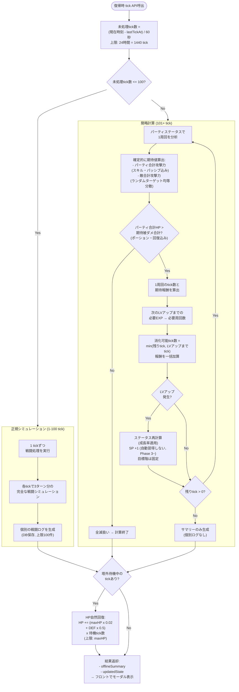

# 戦闘フロー — オフライン計算

> 親: [battle_flow.md](../battle_flow.md)。計算式は [tech_battle.md](../../docs/tech/tech_battle.md)。

## オフライン計算フロー

```mermaid
%%{init: {'theme': 'default', 'themeVariables': {'fontSize': '16px'}} }%%
flowchart TD
    Start([復帰時 tick API呼出]) --> CalcPending["未処理tick数 =\n(現在時刻 - lastTickAt) / 60秒\n上限: 24時間 = 1440 tick"]

    CalcPending --> ThresholdCheck{"未処理tick数 <= 100?"}

    ThresholdCheck -->|Yes| NormalCalc
    ThresholdCheck -->|No| FastCalc

    subgraph NormalCalc["正規シミュレーション (1-100 tick)"]
        NormalStart["1 tickずつ\n戦闘処理を実行"]
        NormalStart --> NormalLoop["各tickで3ターン分の\n完全な戦闘シミュレーション"]
        NormalLoop --> NormalLog["個別の戦闘ログを生成\n(DB保存, 上限100件)"]
    end

    subgraph FastCalc["簡略計算 (101+ tick)"]
        FastStart["パーティステータスで\n1周回を分析"]
        FastStart --> ExpectedDmg["確定的に期待値算出:\n- パーティ合計攻撃力\n  (スキル・パッシブ込み)\n- 敵合計攻撃力\n  (ランダムターゲット均等分散)"]
        ExpectedDmg --> WipeJudge{"パーティ合計HP >\n期待被ダメ合計?\n(ポーション・回復込み)"}
        WipeJudge -->|No| FastWipe["全滅扱い → 計算終了"]
        WipeJudge -->|Yes| CalcCycle["1周回のtick数と\n期待報酬を算出"]
        CalcCycle --> CalcLvUp["次のLVアップまでの\n必要EXP → 必要周回数"]
        CalcLvUp --> BulkAdd["消化可能tick数 =\nmin(残りtick, LVアップまでtick)\n報酬を一括加算"]
        BulkAdd --> LvUpCheck{"LVアップ\n発生?"}
        LvUpCheck -->|Yes| Recalc["ステータス再計算\n(成長率適用)\nSP +1 (自動習得しない, Phase 3~)\n目標階は固定"]
        LvUpCheck -->|No| MoreTicks{"残りtick > 0?"}
        Recalc --> MoreTicks
        MoreTicks -->|Yes| FastStart
        MoreTicks -->|No| FastEnd["サマリーのみ生成\n(個別ログなし)"]
    end

    NormalLog --> TowerIdle
    FastEnd --> TowerIdle
    FastWipe --> TowerIdle

    TowerIdle{"塔外待機中の\ntickあり?"}
    TowerIdle -->|Yes| NaturalHeal["HP自然回復:\nHP += (maxHP x 0.02\n+ DEF x 0.5)\nx 待機tick数\n(上限: maxHP)"]
    TowerIdle -->|No| Result

    NaturalHeal --> Result["結果返却:\n- offlineSummary\n- updatedState\n→ フロントでモーダル表示"]
```
