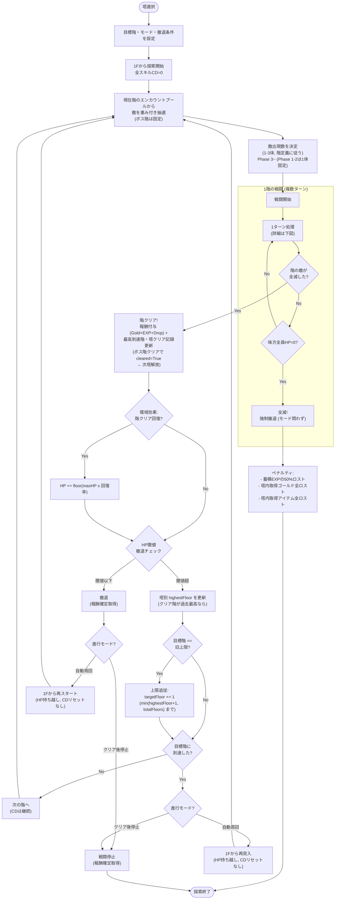
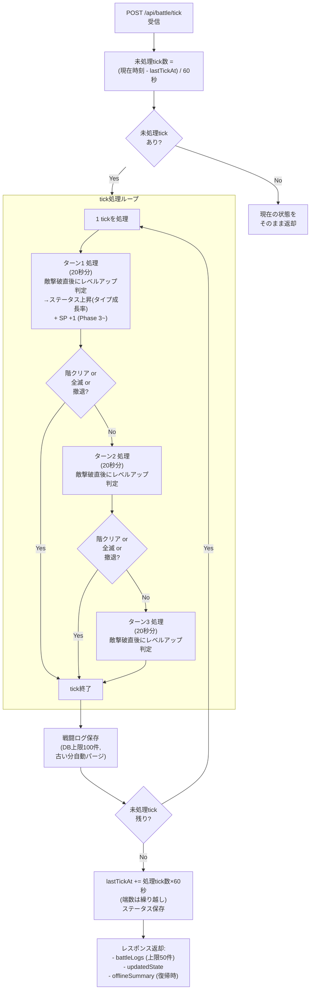

# 戦闘フロー — 塔探索・tick処理

> 親: [battle_flow.md](../battle_flow.md)。仕様は [systems/battle.md](../../docs/design/systems/battle.md)。

## 塔探索の全体フロー

```mermaid
%%{init: {'theme': 'default', 'themeVariables': {'fontSize': '16px'}} }%%
flowchart TD
    Start([塔選択]) --> SetParams["目標階・モード・撤退条件を設定"]
    SetParams --> Enter["1Fから探索開始\n全スキルCD=0"]

    Enter --> Encounter["現在階のエンカウントプールから\n敵を重み付き抽選\n(ボス階は固定)"]
    Encounter --> EnemyCount["敵出現数を決定\n(1-3体, 階定義に従う)\nPhase 3~ (Phase 1-2は1体固定)"]
    EnemyCount --> BattleStart["戦闘開始"]

    subgraph 戦闘ループ["1階の戦闘 (複数ターン)"]
        BattleStart --> Turn["1ターン処理\n(詳細は下図)"]
        Turn --> FloorDone{"階の敵が\n全滅した?"}
        FloorDone -->|No| WipeCheck1{"味方全員HP=0?"}
        WipeCheck1 -->|No| Turn
        WipeCheck1 -->|Yes| Wipe
    end

    FloorDone -->|Yes| FloorClear["階クリア!\n報酬付与 (Gold+EXP+Drop) +\n最高到達階・塔クリア記録更新\n(ボス階クリアで cleared=True\n→ 次塔解放)"]

    FloorClear --> EnvRecovery{"環境効果:\n階クリア回復?"}
    EnvRecovery -->|Yes| HealEnv["HP += floor(maxHP x 回復率)"]
    EnvRecovery -->|No| CheckHP

    HealEnv --> CheckHP{"HP閾値\n撤退チェック"}
    CheckHP -->|閾値以下| Retreat["撤退\n(報酬確定取得)"]
    CheckHP -->|閾値超| UpdateHighest["塔別 highestFloor を更新\n(クリア階が過去最高なら)"]
    UpdateHighest --> FollowCheck{"目標階 ==\n旧上限?"}
    FollowCheck -->|Yes| FollowUp["上限追従:\ntargetFloor += 1\n(min(highestFloor+1, totalFloors) まで)"]
    FollowCheck -->|No| GoalCheck{"目標階に\n到達した?"}
    FollowUp --> GoalCheck

    Retreat --> RetreatModeCheck{"進行モード?"}
    RetreatModeCheck -->|自動周回| RetreatRestart["1Fから再スタート\n(HP持ち越し, CDリセットなし)"]
    RetreatModeCheck -->|クリア後停止| Stop

    GoalCheck -->|No| NextFloor["次の階へ\n(CDは継続)"]
    GoalCheck -->|Yes| ModeCheck{"進行モード?"}

    ModeCheck -->|自動周回| Restart["1Fから再突入\n(HP持ち越し, CDリセットなし)"]
    ModeCheck -->|クリア後停止| Stop["戦闘停止\n(報酬確定取得)"]

    NextFloor --> Encounter
    Restart --> Encounter
    RetreatRestart --> Encounter

    Wipe["全滅!\n強制撤退 (モード問わず)"]
    Wipe --> Penalty["ペナルティ:\n- 蓄積EXPの50%ロスト\n- 塔内取得ゴールド全ロスト\n- 塔内取得アイテム全ロスト"]
    Penalty --> End([探索終了])
    Stop --> End
```

## tick処理フロー

```mermaid
%%{init: {'theme': 'default', 'themeVariables': {'fontSize': '16px'}} }%%
flowchart TD
    API["POST /api/battle/tick\n受信"] --> CalcTicks["未処理tick数 =\n(現在時刻 - lastTickAt) / 60秒"]

    CalcTicks --> HasTicks{"未処理tick\nあり?"}
    HasTicks -->|No| Return["現在の状態を\nそのまま返却"]
    HasTicks -->|Yes| TickLoop

    subgraph TickLoop["tick処理ループ"]
        ProcessTick["1 tickを処理"]
        ProcessTick --> T1["ターン1 処理\n(20秒分)\n敵撃破直後にレベルアップ判定\n→ステータス上昇(タイプ成長率)\n+ SP +1 (Phase 3~)"]
        T1 --> T1Result{"階クリア or\n全滅 or\n撤退?"}
        T1Result -->|No| T2["ターン2 処理\n(20秒分)\n敵撃破直後にレベルアップ判定"]
        T1Result -->|Yes| TickEnd

        T2 --> T2Result{"階クリア or\n全滅 or\n撤退?"}
        T2Result -->|No| T3["ターン3 処理\n(20秒分)\n敵撃破直後にレベルアップ判定"]
        T2Result -->|Yes| TickEnd

        T3 --> TickEnd["tick終了"]
    end

    TickEnd --> LogSave["戦闘ログ保存\n(DB上限100件,\n古い分自動パージ)"]

    LogSave --> MoreTicks{"未処理tick\n残り?"}
    MoreTicks -->|Yes| ProcessTick
    MoreTicks -->|No| UpdateDB["lastTickAt += 処理tick数×60秒\n(端数は繰り越し)\nステータス保存"]

    UpdateDB --> Response["レスポンス返却:\n- battleLogs (上限50件)\n- updatedState\n- offlineSummary (復帰時)"]
```
