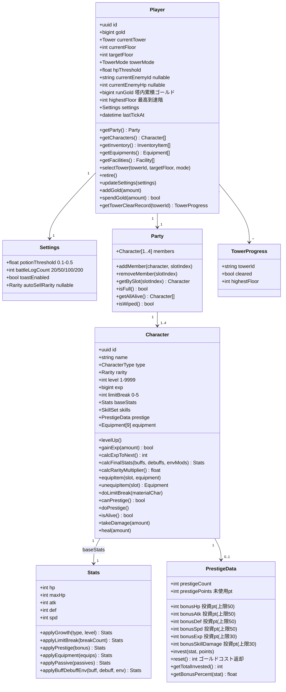
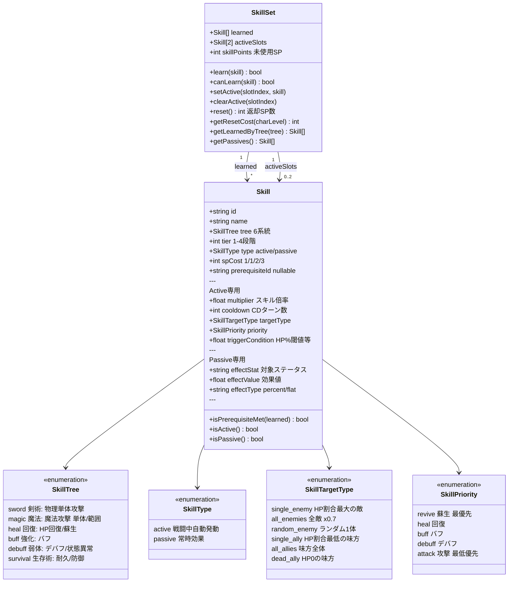
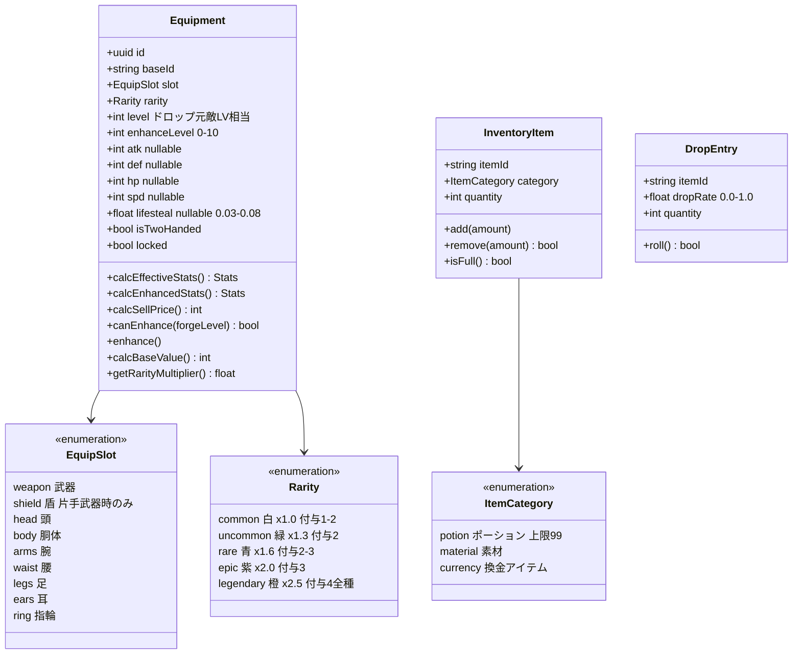
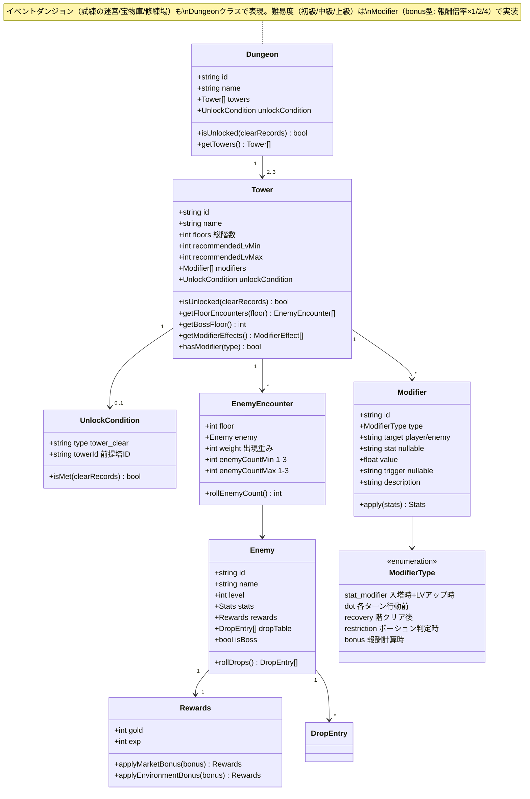
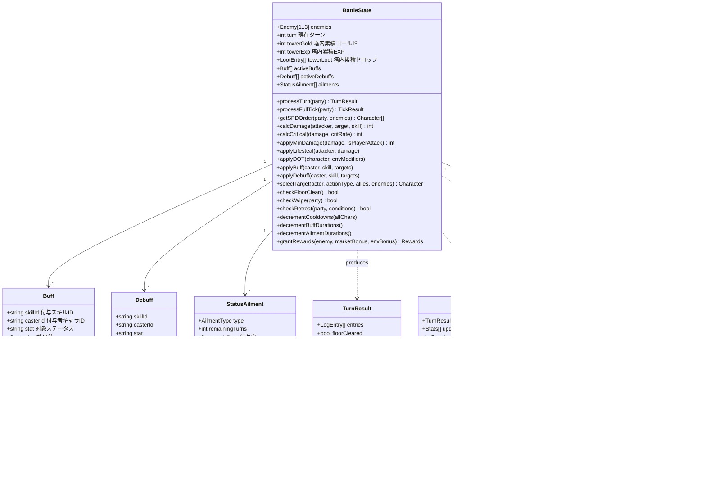
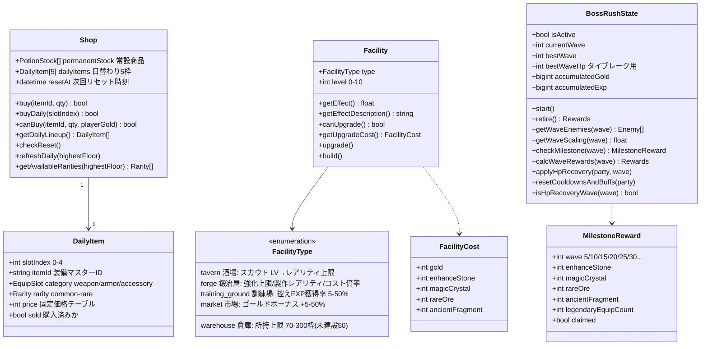

# クラス図（ドメインモデル）

> ゲーム仕様: [game_spec.md](docs/design/game_spec.md) / 技術仕様: [tech_spec.md](docs/tech/tech_spec.md)

## プレイヤー・パーティ・キャラクター

## スキルシステム

## 装備・アイテム

## ダンジョン・塔・敵

## 戦闘状態

## ショップ・施設・ボスラッシュ

