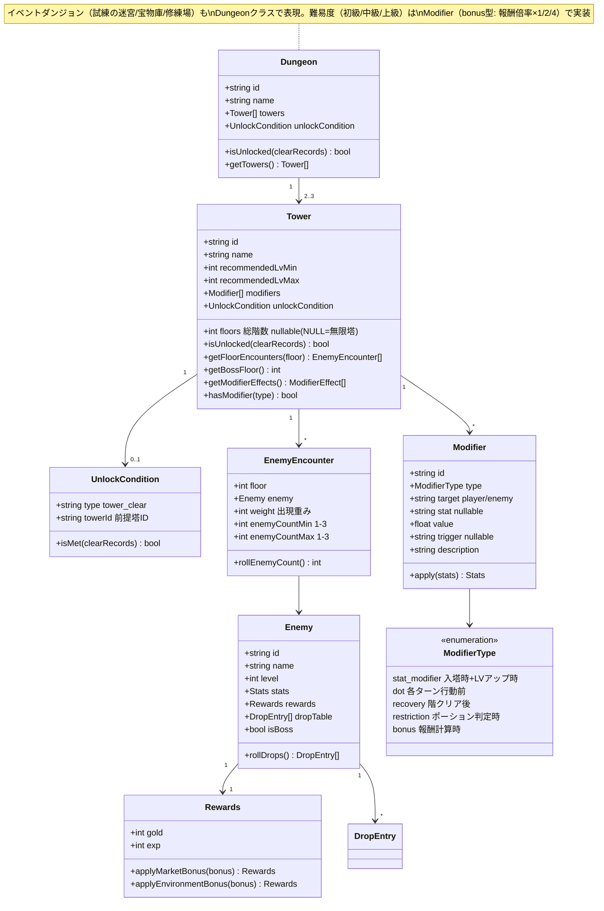
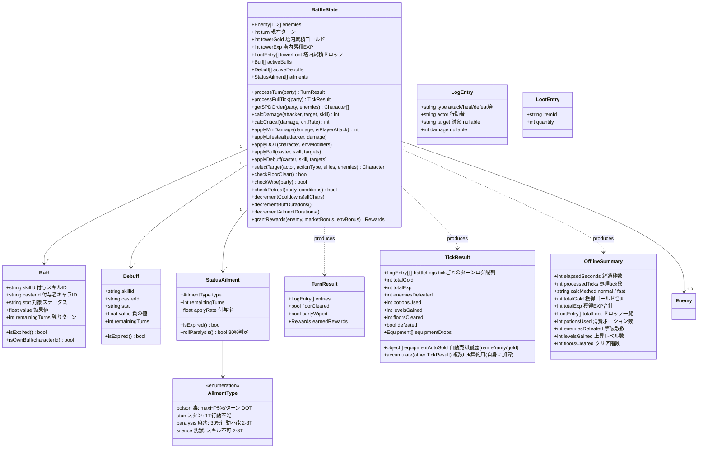

# クラス図 — ダンジョン・敵・戦闘状態

> 親: [class_diagram.md](../class_diagram.md)。仕様は [systems/battle.md](../../docs/design/systems/battle.md) / [systems/dungeon.md](../../docs/design/systems/dungeon.md)。

## ダンジョン・塔・敵

## 戦闘状態

