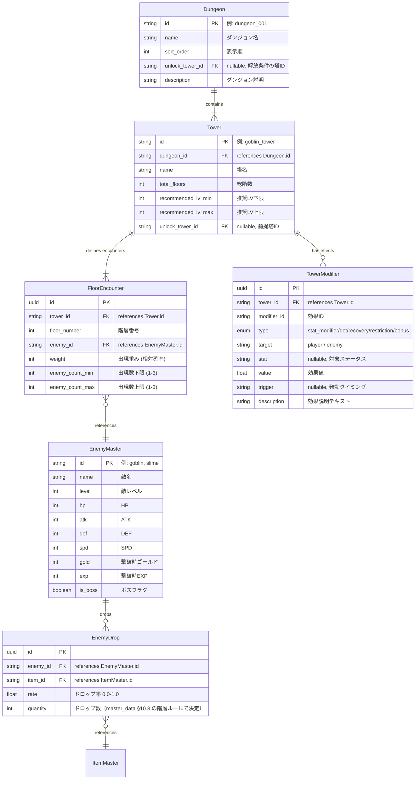

# ER図 — 戦闘・ボスラッシュ・マスターデータ

> 親: [er_diagram.md](../er_diagram.md)。データ構造は [tech_data.md](../../docs/tech/tech_data.md)、数値は [master_data.md](../../docs/data/master_data.md)。

## 戦闘・ボスラッシュ系

```mermaid
%%{init: {'theme': 'default', 'themeVariables': {'fontSize': '16px'}} }%%
erDiagram
    Player ||--o{ BattleLog : "has max 100"
    Player ||--o| BossRushState : "has"
    BossRushState ||--o{ BossRushMilestone : "tracks"

    BattleLog {
        uuid id PK
        uuid player_id FK "references Player.id"
        int tick_number "tick通番"
        datetime timestamp "処理時刻"
        json entries "ターンごとの行動ログ配列"
    }

    BossRushState {
        uuid id PK
        uuid player_id FK "references Player.id"
        boolean is_active "ボスラッシュ中か"
        int current_wave "現在ウェーブ"
        bigint accumulated_gold "累積獲得ゴールド"
        bigint accumulated_exp "累積獲得EXP"
        int best_wave "自己ベスト到達ウェーブ"
        int best_wave_hp "ベスト時の残HP合計 (タイブレーク用)"
    }

    BossRushMilestone {
        uuid id PK
        uuid boss_rush_state_id FK "references BossRushState.id"
        int wave "到達ウェーブ (5,10,15,...)"
        boolean claimed "報酬受取済みか"
        datetime claimed_at "nullable"
    }
```

## ダンジョン・塔・敵系（マスターデータ）

> **注**: このブロックのエンティティはDBテーブルではなく、コード内定義のマスターデータ（`backend/app/master_data/` 配下のdataclass）。FK表記は論理参照を示す（DBレベルのFK制約はない）。Dungeon・TowerModifier・recommended_lv等は将来のDB化を見据えた論理設計であり、現実装のTowerDataには未実装（Phase 3以降で追随）。

