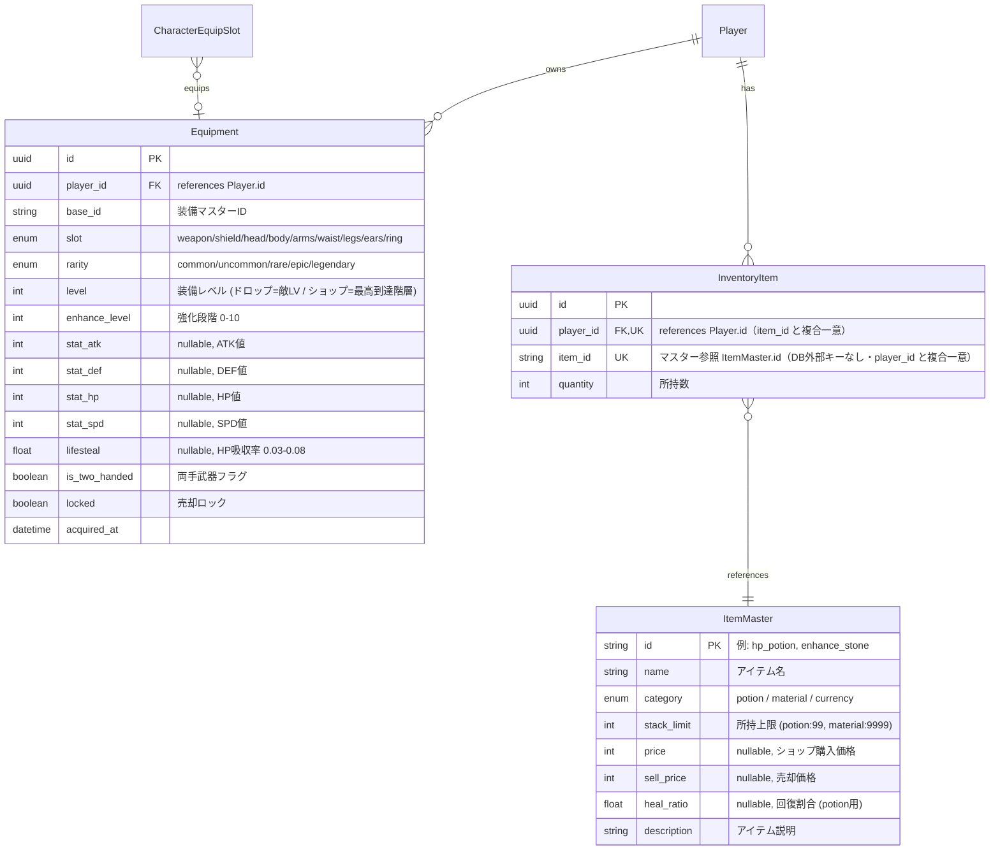
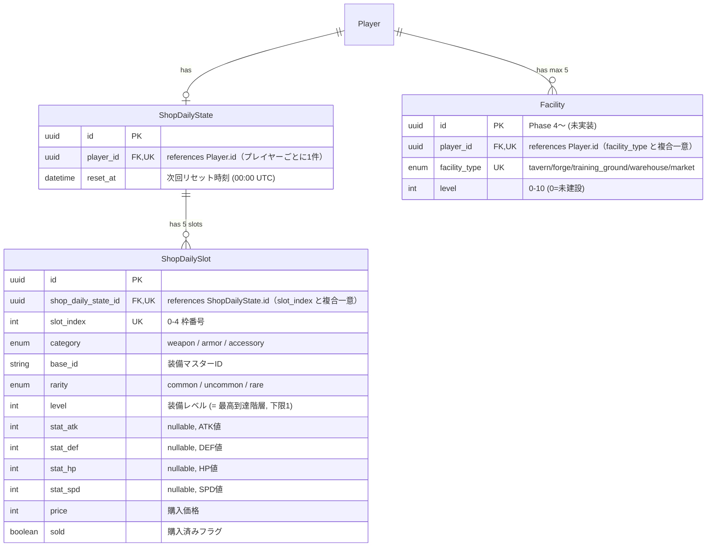

# ER図 — 装備・アイテム・ショップ・施設

> 親: [er_diagram.md](../er_diagram.md)。**DBスキーマの正は** [tech_db/item.md](../../docs/tech/basic/tech_db/item.md) であり、本図は視覚化として属性を再掲する（食い違いは定義書側へ揃える）。データ構造は [tech_data.md](../../docs/tech/basic/tech_data.md)、日替わりショップの生成・購入は [tech_shop.md](../../docs/tech/detail/tech_shop.md)。

## 装備・アイテム系

> **注**: `ItemMaster` はDBテーブルではなく、コード内定義のマスターデータ（`backend/app/master_data/items.py`）。`InventoryItem.item_id` は他のマスター参照列と同じく `FK` タグを付けず、`InventoryItem }o--|| ItemMaster` のリレーション線が論理参照を示す（DBレベルのFK制約はない。親 [tech_db.md](../../docs/tech/basic/tech_db.md) §4-6）。`InventoryItem` 側は `category` を列として持たず、`item_id` から `ItemMaster` を引いて得る。

## ショップ・施設系

