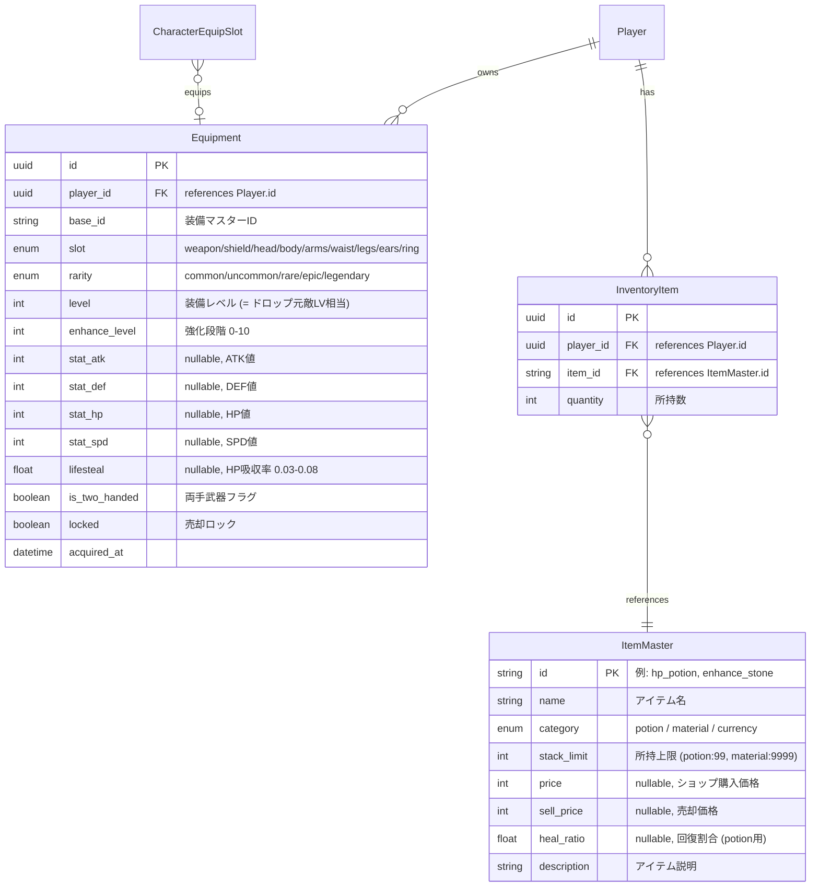
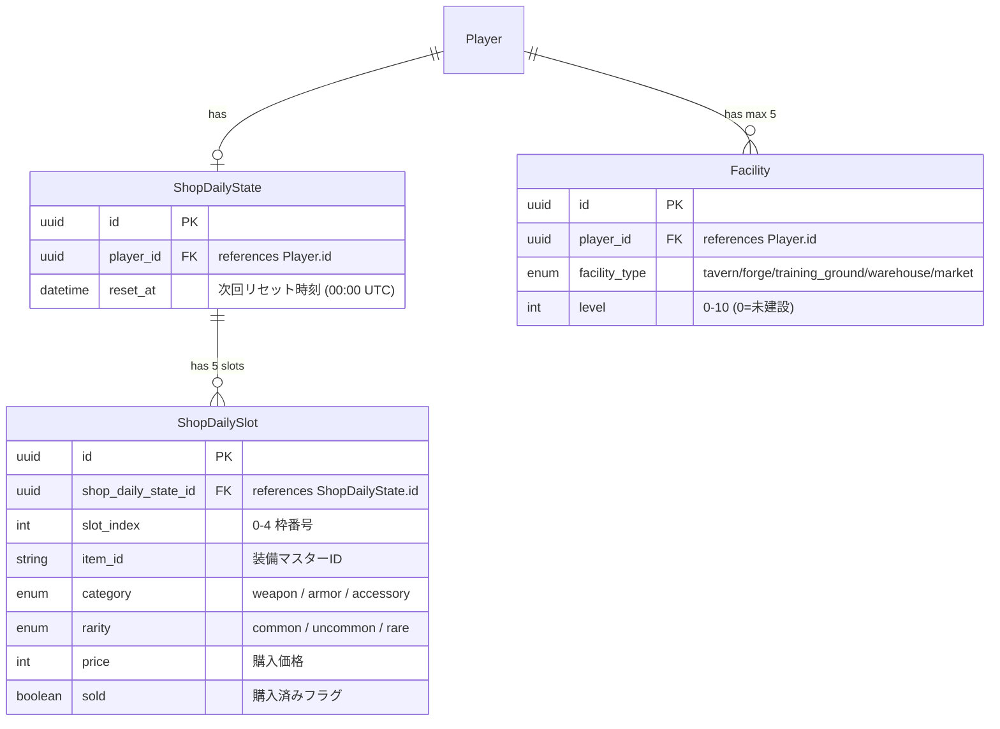

# ER図 — 装備・アイテム・ショップ・施設

> 親: [er_diagram.md](../er_diagram.md)。データ構造は [tech_data.md](../../docs/tech/tech_data.md)。

## 装備・アイテム系

```mermaid
%%{init: {'theme': 'default', 'themeVariables': {'fontSize': '16px'}} }%%
erDiagram
    Player ||--o{ Equipment : "owns"
    Player ||--o{ InventoryItem : "has"
    CharacterEquipSlot }o--o| Equipment : "equips"
    InventoryItem }o--|| ItemMaster : "references"

    Equipment {
        uuid id PK
        uuid player_id FK "references Player.id"
        string base_id "装備マスターID"
        enum slot "weapon/shield/head/body/arms/waist/legs/ears/ring"
        enum rarity "common/uncommon/rare/epic/legendary"
        int level "装備レベル (= ドロップ元敵LV相当)"
        int enhance_level "強化段階 0-10"
        int stat_atk "nullable, ATK値"
        int stat_def "nullable, DEF値"
        int stat_hp "nullable, HP値"
        int stat_spd "nullable, SPD値"
        float lifesteal "nullable, HP吸収率 0.03-0.08"
        boolean is_two_handed "両手武器フラグ"
        boolean locked "売却ロック"
        datetime acquired_at
    }

    InventoryItem {
        uuid id PK
        uuid player_id FK "references Player.id"
        string item_id FK "references ItemMaster.id"
        int quantity "所持数"
    }

    ItemMaster {
        string id PK "例: hp_potion, enhance_stone"
        string name "アイテム名"
        enum category "potion / material / currency"
        int stack_limit "所持上限 (potion:99, material:9999)"
        int price "nullable, ショップ購入価格"
        int sell_price "nullable, 売却価格"
        float heal_ratio "nullable, 回復割合 (potion用)"
        string description "アイテム説明"
    }
```

## ショップ・施設系

```mermaid
%%{init: {'theme': 'default', 'themeVariables': {'fontSize': '16px'}} }%%
erDiagram
    Player ||--o| ShopDailyState : "has"
    Player ||--o{ Facility : "has max 5"

    ShopDailyState ||--o{ ShopDailySlot : "has 5 slots"

    ShopDailyState {
        uuid id PK
        uuid player_id FK "references Player.id"
        datetime reset_at "次回リセット時刻 (00:00 UTC)"
    }

    ShopDailySlot {
        uuid id PK
        uuid shop_daily_state_id FK "references ShopDailyState.id"
        int slot_index "0-4 枠番号"
        string item_id "装備マスターID"
        enum category "weapon / armor / accessory"
        enum rarity "common / uncommon / rare"
        int price "購入価格"
        boolean sold "購入済みフラグ"
    }

    Facility {
        uuid id PK
        uuid player_id FK "references Player.id"
        enum facility_type "tavern/forge/training_ground/warehouse/market"
        int level "0-10 (0=未建設)"
    }
```
