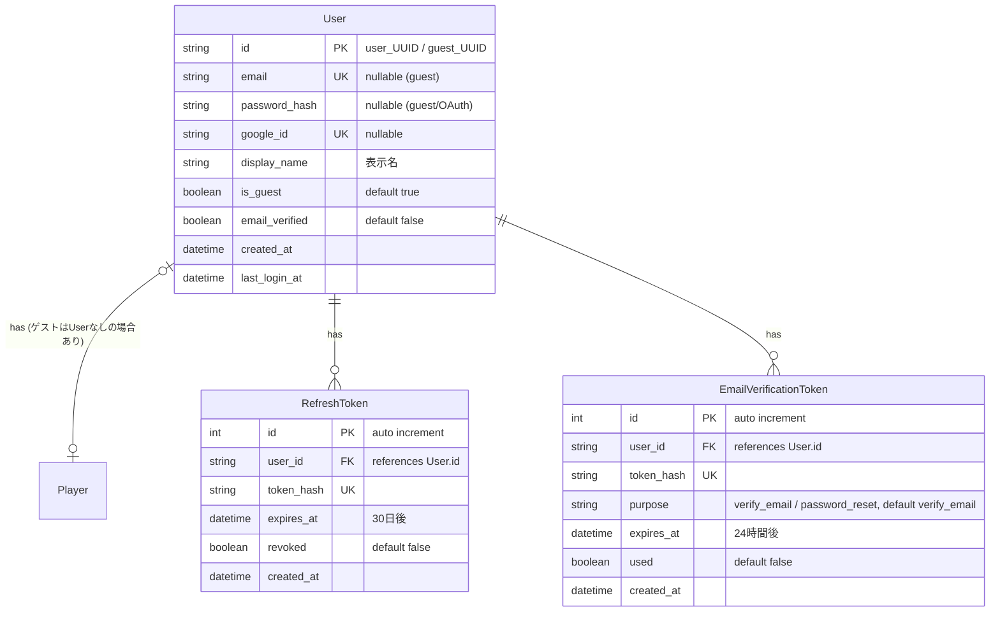
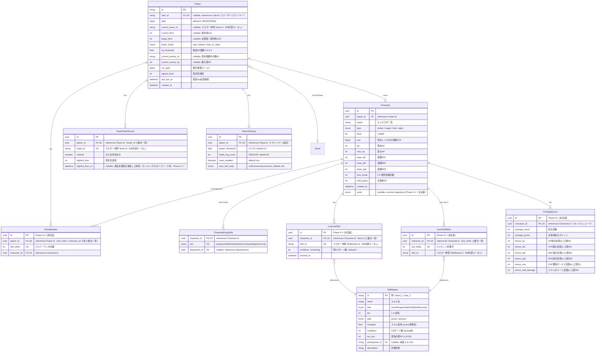

# ER図 — 認証・プレイヤー・キャラクター

> 親: [er_diagram.md](../er_diagram.md)。**DBスキーマの正は** [tech_db/auth.md](../../docs/tech/basic/tech_db/auth.md)・[tech_db/player.md](../../docs/tech/basic/tech_db/player.md)（`CharacterEquipSlot` のみ [tech_db/item.md](../../docs/tech/basic/tech_db/item.md)）であり、本図は視覚化として属性を再掲する（食い違いは定義書側へ揃える）。データ構造は [tech_data.md](../../docs/tech/basic/tech_data.md)、認証は [tech_auth.md](../../docs/tech/detail/tech_auth.md)。

## 認証・アカウント系

## プレイヤー・キャラクター系

