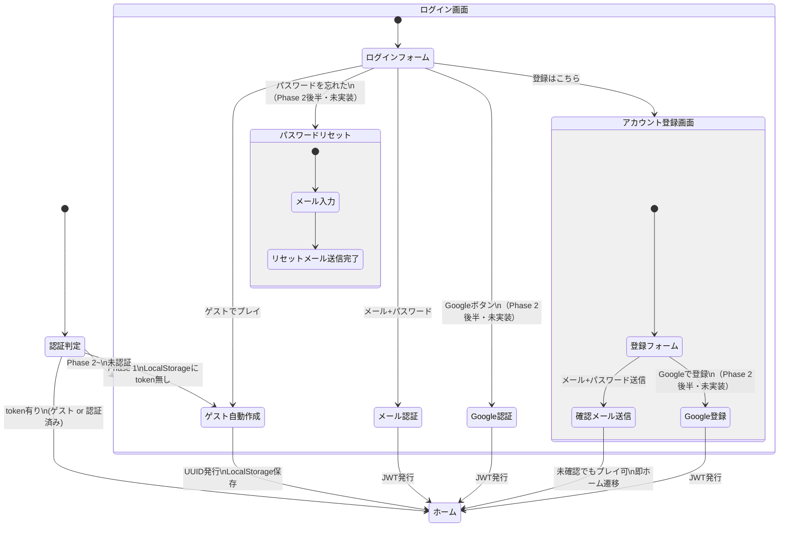
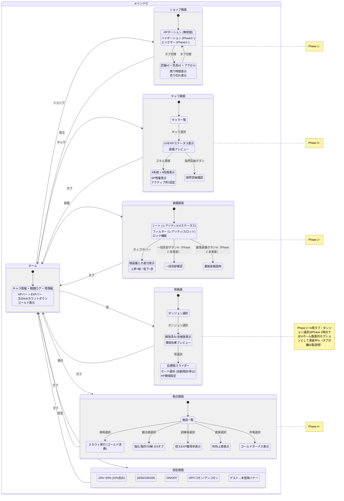
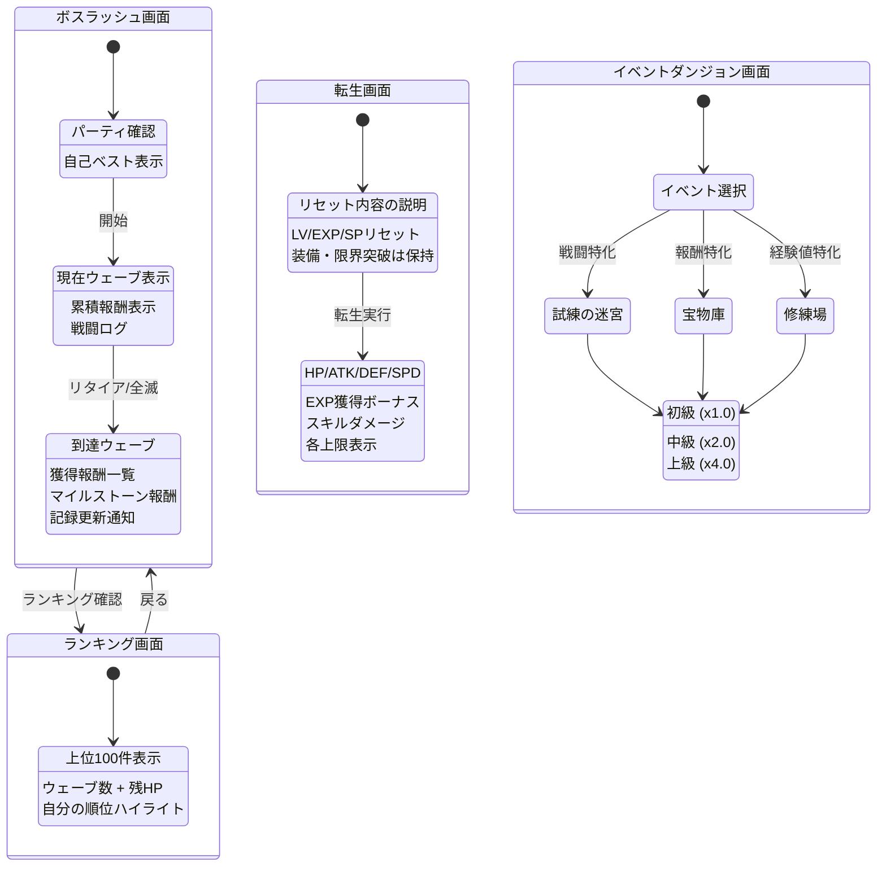
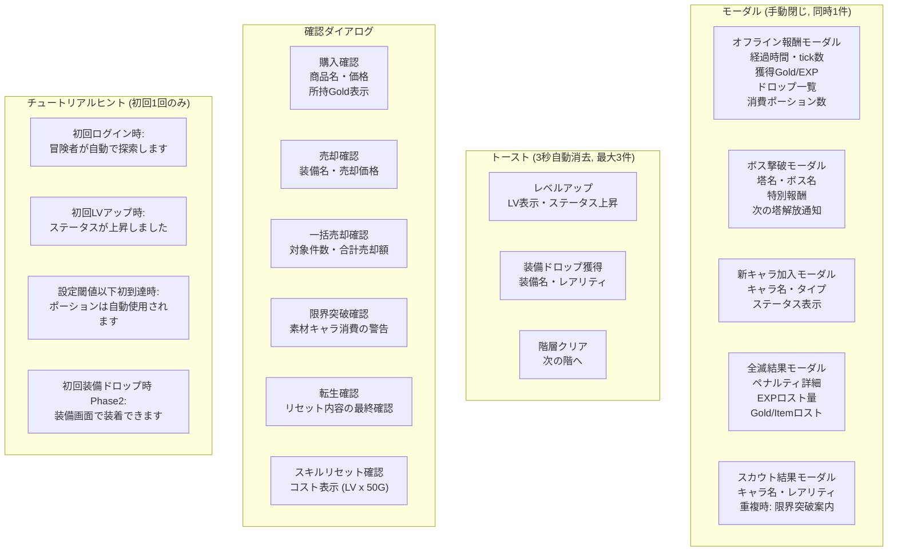

# 画面遷移図

> UI仕様: [game_spec.md §3](docs/design/game_spec.md)

## 認証・エントリーフロー

## メインナビゲーション構造

## Phase 5 追加コンテンツ

## モーダル・ダイアログ一覧

## Phase別タブ構成

| Phase | ナビゲーションタブ |
|-------|------------------|
| Phase 1 | ホーム, ショップ, 設定 |
| Phase 2 | ホーム, ショップ, **装備**, **塔**, 設定 |
| Phase 3 | ホーム, ショップ, **キャラ**, 装備, 塔, 設定 |
| Phase 4 | ホーム, ショップ, キャラ, 装備, 塔, **拠点**, 設定 |
| Phase 5 | ホーム, ショップ, キャラ, 装備, 塔, 拠点, 設定 + **ボスラッシュ**, **イベント** |

- モバイル: ボトムナビ
- PC: サイドナビ
- Phase 1 ではホーム + ショップ + 設定のみ表示
- 塔タブ・ダンジョン選択はPhase 2時点ではホーム画面内セクションとして実装中（タブ分離は製造残。構成自体は仕様準拠のため変更なし）

## 通知システム

| 種別 | 表示方法 | 消去 | 最大同時 |
|------|---------|------|---------|
| ログ内通知 | 戦闘ログ内にインライン | 自動スクロール | 制限なし |
| トースト | 画面上部に一時表示 | 3秒で自動消去 | 3件 |
| モーダル | 画面中央ダイアログ | 手動で閉じる | 1件 |
