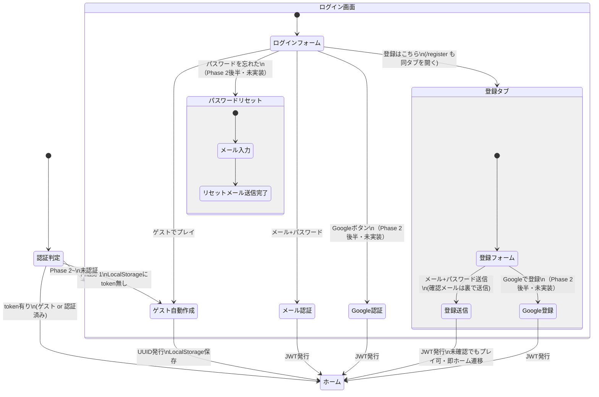

# 画面遷移図 — 認証・エントリーフロー

> 親: [screen_transition.md](../screen_transition.md)。UI仕様は [systems/ui.md](../../docs/design/systems/ui.md) §3、認証仕様は [tech_auth.md](../../docs/tech/tech_auth.md)。

## 認証・エントリーフロー

- **登録は独立画面ではなくログイン画面内のタブ**（UXの観点で統合）。`/register` へ直接アクセスした場合もログイン画面の登録タブへ寄せる
- 登録直後に確認メール送信の完了を待つUI状態は持たない。送信はバックグラウンドで行い、即ホームへ遷移する
- 対応するAPIシーケンスは [api_sequence/auth.md](../api_sequence/auth.md)
- 退会（アカウント削除）とログアウトの画面構成は [main_nav.md](main_nav.md) の設定画面。いずれも実行後は**本図の ログイン画面**へ戻る
