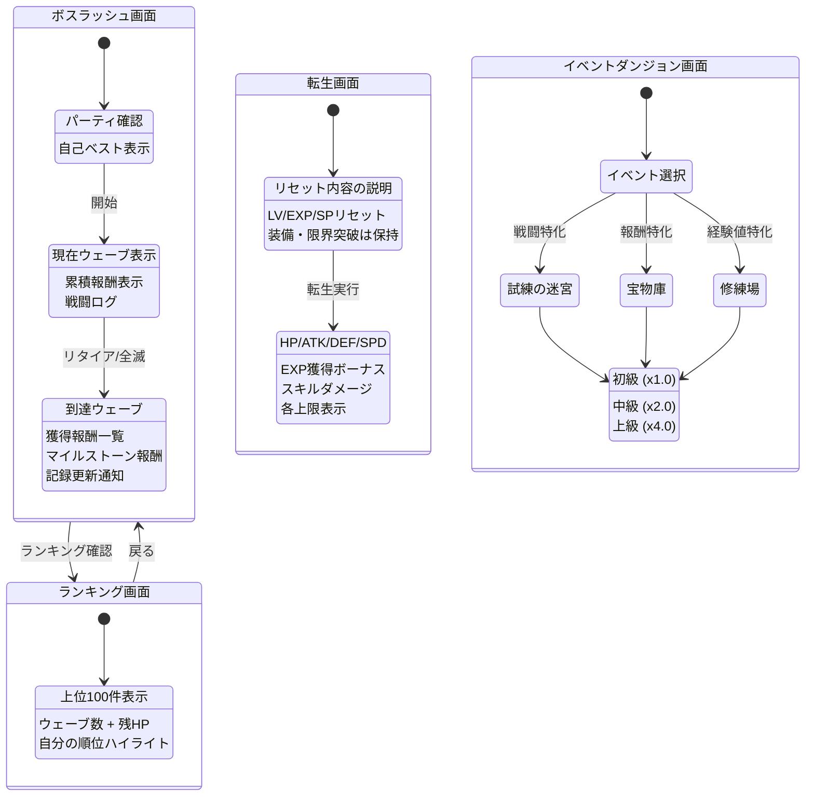

# 画面遷移図 — Phase 5 追加コンテンツ

> 親: [screen_transition.md](../screen_transition.md)。仕様は [systems/endgame.md](../../docs/design/systems/endgame.md)、UI仕様は [systems/ui.md](../../docs/design/systems/ui.md) §3。

## Phase 5 追加コンテンツ

- ボスラッシュ・イベントダンジョンへの**導線**（タブ追加かホーム内セクションか）は未確定（[open_specs.md](../../docs/open_specs.md) #4 で管理。正は [systems/ui.md](../../docs/design/systems/ui.md) ナビゲーション構造、タブ構成の現状は [main_nav.md](main_nav.md)「Phase別タブ構成」）
