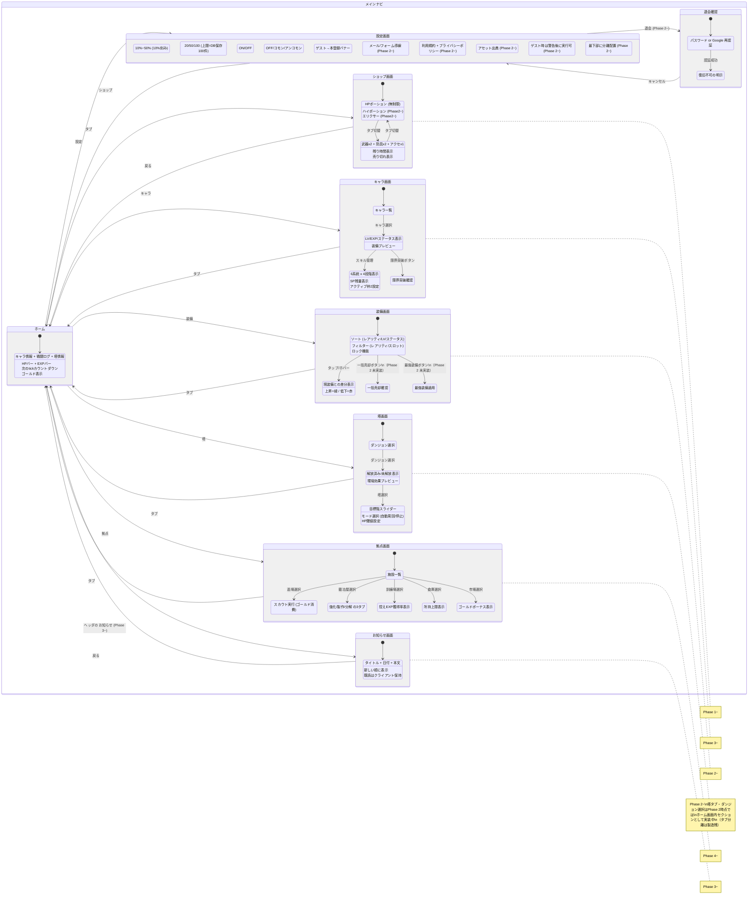

# 画面遷移図 — メインナビゲーション構造

> 親: [screen_transition.md](../screen_transition.md)。UI仕様は [systems/ui.md](../../docs/design/systems/ui.md) §3。

## メインナビゲーション構造

- ヘッダ（ゲームタイトル／お知らせ／設定）は全画面共通。保存操作は置かない（[systems/ui.md](../../docs/design/systems/ui.md)「ヘッダ（全画面共通）」）

## Phase別タブ構成

| Phase | ナビゲーションタブ |
|-------|------------------|
| Phase 1 | ホーム, ショップ, 設定 |
| Phase 2 | ホーム, ショップ, **装備**, **塔**, 設定 |
| Phase 3 | ホーム, ショップ, **キャラ**, 装備, 塔, 設定 |
| Phase 4 | ホーム, ショップ, キャラ, 装備, 塔, **拠点**, 設定 |
| Phase 5 | ホーム, ショップ, キャラ, 装備, 塔, 拠点, 設定（ボスラッシュ等の導線確定までは Phase 4 のまま据え置き） |

- モバイル: ボトムナビ
- PC: サイドナビ
- Phase 1 ではホーム + ショップ + 設定のみ表示
- 塔タブ・ダンジョン選択はPhase 2時点ではホーム画面内セクションとして実装中（タブ分離は製造残。構成自体は仕様準拠のため変更なし）
- お知らせはタブではなくヘッダ導線（[systems/ui.md](../../docs/design/systems/ui.md)「お知らせ（Phase 3〜）」）
- 退会確認で削除を実行した後、およびログアウト実行後は、メインナビの外にある認証フロー（[auth.md](auth.md)）のログイン画面へ戻る。ログアウトは `POST /api/auth/logout`（[api_sequence/auth.md](../api_sequence/auth.md) §14）を呼ぶ
- ボスラッシュ・イベントダンジョンの導線（タブ追加かホーム内セクションか）は未確定（[open_specs.md](../../docs/open_specs.md) #4 で管理。正は [systems/ui.md](../../docs/design/systems/ui.md) ナビゲーション構造）
