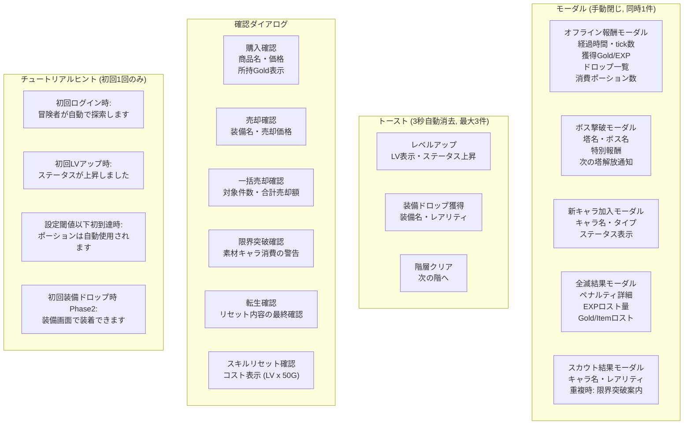

# 画面遷移図 — モーダル・ダイアログ・通知

> 親: [screen_transition.md](../screen_transition.md)。UI仕様は [systems/ui.md](../../docs/design/systems/ui.md) §3「通知システム」。

## モーダル・ダイアログ一覧

- 退会は確認ダイアログではなく**画面遷移を伴うフロー**（再認証 → 削除確認）。[main_nav.md](main_nav.md) を参照

## 通知システム

| 種別 | 表示方法 | 消去 | 最大同時 |
|------|---------|------|---------|
| ログ内通知 | 戦闘ログ内にインライン | 自動スクロール | 制限なし |
| トースト | 画面上部に一時表示 | 3秒で自動消去 | 3件 |
| モーダル | PC: 画面中央 / モバイル: 下寄せ | 手動で閉じる | 1件 |

- モーダル・ダイアログの実体は `components/ui/BaseModal` 1点。表示位置・閉じ方（Esc・背面タップ）・背面スクロール抑止は [tech_design_system.md](../../docs/tech/detail/tech_design_system.md) §2 が正。画面ごとに自前で組まない
- 待ちキューのルール（FIFO・上限10件・エラー通知の割り込み）は [systems/ui.md](../../docs/design/systems/ui.md)「通知キューのルール」が正
