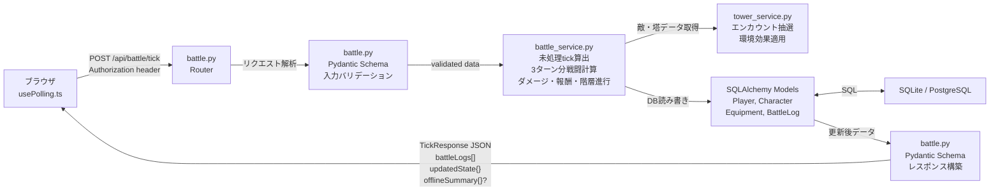

# システム構成図

> 技術仕様: [tech_spec.md](docs/tech/tech_spec.md)

## 全体アーキテクチャ

```mermaid
%%{init: {'theme': 'default', 'themeVariables': {'fontSize': '16px'}} }%%
flowchart TB
    subgraph Client["ブラウザ (Vue.js 3 SPA + TypeScript)"]
        direction TB

        subgraph Views["Views (ページコンポーネント)"]
            GameView["GameView.vue\n(メインゲーム画面)\nPhase 1~"]
            ShopView["ShopView.vue\n(ショップ)\nPhase 1~"]
            LoginView["LoginView.vue\n(ログイン)\nPhase 2~"]
            RegisterView["RegisterView.vue\n(登録)\nPhase 2~"]
            EquipView["EquipmentView.vue\n(装備管理)\nPhase 2~"]
            PartyView["PartyView.vue\n(パーティ編成)\nPhase 3~"]
            BaseView["BaseView.vue\n(拠点施設)\nPhase 4~"]
            BossRushView["BossRushView.vue\n(ボスラッシュ)\nPhase 5~"]
            EventView["EventView.vue\n(イベントダンジョン)\nPhase 5~"]
        end

        subgraph Components["Components (UI部品)"]
            BattleLog["BattleLog.vue\n戦闘ログ表示\n自動スクロール"]
            CharStatus["CharacterStatus.vue\nLV/HP/ATK/DEF/SPD\nEXPバー"]
            TowerInfo["TowerInfo.vue\n塔名・階層・モード\n環境効果表示"]
            HpBar["HpBar.vue\nHP/maxHP ゲージ\nCSS width%"]
            OfflineModal["OfflineRewardModal.vue\nオフライン報酬サマリー"]
            Toast["ToastNotification.vue\n最大3件・3秒消去"]
        end

        subgraph Stores["Pinia Stores (状態管理)"]
            gameStore["gameStore.ts\nゴールド・塔情報・設定\nゲーム全体状態"]
            battleStore["battleStore.ts\n戦闘ログ・敵情報\nターン数"]
            playerStore["playerStore.ts\nキャラクター一覧\nパーティ・インベントリ"]
            authStore["authStore.ts\nJWTトークン\nユーザーセッション\nPhase 2~"]
        end

        subgraph Composables["Composables (ロジック)"]
            usePolling["usePolling.ts\n60秒ポーリング制御\nsetInterval管理"]
            useGameLoop["useGameLoop.ts\nゲーム起動・状態管理\n復帰時処理"]
            useBattleLocal["useBattleLocal.ts\nローカル計算\n(デバッグ用フォールバック)"]
            useAuth["useAuth.ts\n認証ロジック\nPhase 2~"]
        end

        Router["router/index.ts\nVue Router\n画面ルーティング"]
        APIClient["api/client.ts\nAxios/fetch\nREST通信レイヤー\nUSE_APIフラグ"]
        Types["types/game.ts\nTypeScript型定義\nゲーム関連の型"]
        Assets["assets/\nicons/ アイコン画像\nstyles/ CSS"]

        Router --> Views
        Views --> Components
        Views --> Stores
        Views --> Composables
        Composables --> Stores
        Composables --> APIClient
        Components --> Stores

        GameView --> BattleLog
        GameView --> CharStatus
        GameView --> TowerInfo
        GameView --> HpBar
        GameView --> OfflineModal
    end

    APIClient <-->|"REST API (JSON)\nAuthorization: Bearer token"| Routers

    subgraph Server["FastAPI バックエンド (Python)"]
        direction TB

        subgraph Routers["Routers (APIエンドポイント)"]
            authRouter["auth.py\nPOST /api/auth/guest\nPOST /api/auth/login\nPOST /api/auth/register\nPOST /api/auth/google\nPOST /api/auth/refresh\n他5エンドポイント"]
            gameRouter["game.py\nGET /api/game/state\nPUT /api/game/settings"]
            battleRouter["battle.py\nPOST /api/battle/tick"]
            towerRouter["tower.py\nPOST /api/tower/select\nPOST /api/tower/retire\nPUT /api/tower/mode\nPUT /api/tower/retreat-conditions"]
            shopRouter["shop.py\nGET /api/shop/lineup\nPOST /api/shop/buy"]
            equipRouter["equipment.py\nGET /api/equipment/list\nPOST /api/equipment/equip\nPOST /api/equipment/sell\nPOST /api/equipment/lock"]
            partyRouter["party.py Phase3~\nPUT /api/party/edit\nPOST /api/skill/learn\nPUT /api/skill/set-active\nPOST /api/skill/reset\nPOST /api/character/limit-break"]
            baseRouter["base.py Phase4~\nPOST /api/base/build\nPOST /api/base/upgrade\nPOST /api/base/scout"]
            forgeRouter["forge.py Phase4~\nPOST /api/forge/enhance\nPOST /api/forge/craft\nPOST /api/forge/disassemble"]
            bossRushRouter["boss_rush.py Phase5~\nPOST /api/boss-rush/start\nPOST /api/boss-rush/retire\nGET /api/boss-rush/ranking"]
            prestigeRouter["prestige.py Phase5~\nPOST /api/prestige\nPUT /api/prestige/invest\nPOST /api/prestige/reset"]
        end

        subgraph Services["Services (ビジネスロジック)"]
            battleService["battle_service.py\n戦闘計算 (サーバー権威)\nターン処理・ダメージ計算\nオフライン計算 (正規/簡略)"]
            equipService["equipment_service.py\n装備ドロップ・売却・\n実効ステータス計算"]
            towerService["tower_service.py\n塔・階層・敵データ\nエンカウント抽選"]
            shopService["shop_service.py\nショップロジック\n日替わり更新"]
            authService["auth_service.py\n認証ロジック\nJWT/bcrypt Phase2~"]
            baseService["base_service.py\n施設建設・LVアップ\nPhase 4~"]
            forgeService["forge_service.py\n装備強化・製作・分解\nPhase 4~"]
        end

        subgraph Models["Models (SQLAlchemy 2.0)"]
            playerModel["player.py\nPlayer, PlayerSettings\nTowerClearRecord\nParty (Phase3~)"]
            charModel["character.py\nCharacter\nPrestigeBonus (Phase5~)\nLearnedSkill (Phase3~)\nActiveSkillSlot (Phase3~)"]
            equipModel["equipment.py\nEquipment\nCharacterEquipSlot"]
            itemModel["item.py\nBattleLog, InventoryItem\nFacility (Phase4~)\nShopDailyState (Phase2~)\nBossRushState (Phase5~)"]
            userModel["user.py Phase2~\nUser, RefreshToken\nEmailVerificationToken"]
        end

        subgraph Schemas["Schemas (Pydantic v2)"]
            playerSchema["player.py\nPlayerResponse\nSettingsUpdate"]
            charSchema["character.py\nCharacterResponse\nPartyEdit"]
            battleSchema["battle.py\nTickResponse\nBattleLogEntry\nOfflineSummary"]
            authSchema["auth.py Phase2~\nLoginRequest\nTokenResponse"]
        end

        Config["config.py\nTICK_INTERVAL = 60s\nTURNS_PER_TICK = 3\nFAST_CALC_THRESHOLD = 100\nMAX_OFFLINE_HOURS = 24\nMAX_BATTLE_LOG = 100\nMAX_PLAYER_LEVEL = 9999"]
        DB_Module["db/database.py\nDB接続設定\nセッション管理"]
        Alembic["alembic/\nDBマイグレーション\nスキーマ管理"]

        Routers --> Schemas
        Routers --> Services
        Services --> Models
        Models --> DB_Module

        battleService --> towerService
        battleService --> equipService
    end

    DB_Module <-->|"SQLAlchemy ORM"| DB

    subgraph DB["データベース"]
        SQLite["SQLite\n(MVP / Phase 1)\n開発・テスト用"]
        PostgreSQL["PostgreSQL\n(本番)\nPhase 2~"]
    end

    Alembic -->|"マイグレーション"| DB

    style Client fill:#e8f5e9
    style Server fill:#e3f2fd
    style DB fill:#fff3e0
```

## tick処理のデータフロー

## サーバー権威モデル

| 処理 | 実行場所 | 詳細 |
|------|---------|------|
| 戦闘計算（tick処理） | **サーバー** | ダメージ・クリティカル・スキル・状態異常すべてサーバーで計算。チート対策 |
| 報酬付与 | **サーバー** | Gold/EXP/ドロップをDB直接更新。クライアントは結果を受け取るのみ |
| オフライン計算 | **サーバー** | 復帰時に経過tick分をまとめてシミュレーション (正規 or 簡略) |
| 塔進行・撤退判定 | **サーバー** | tick処理内で階クリア・撤退条件・全滅をすべて判定 |
| ショップ購入 | **サーバー** | 在庫・価格・残金チェックをサーバーで実行 |
| データ永続化 | **サーバー** | SQLite (MVP) / PostgreSQL (本番) |
| UI表示 | **クライアント** | 戦闘ログのテキスト表示、ゲージ描画、モーダル表示 |
| ポーリング制御 | **クライアント** | 60秒間隔のsetInterval管理、visibilitychange検知 |
| ローカル計算 | **クライアント** | useBattleLocal.ts — **デバッグ用のみ**。USE_API=false時のフォールバック |

## エラーハンドリング

| 段階 | 動作 | 待機時間 |
|------|------|---------|
| リトライ1回目 | 同じAPIを再送 | 1秒後 |
| リトライ2回目 | 同じAPIを再送 | 2秒後 |
| リトライ3回目 | 同じAPIを再送 | 4秒後 |
| 3回失敗 | 「接続エラー」バナー表示。最終取得データをそのまま表示 | 次のtick(60秒後)で自動リトライ再開 |
| 復帰時 | サーバーから最新状態を取得して画面更新 | — |
