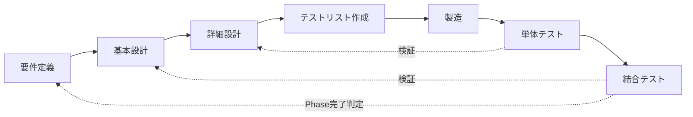

# AFK GAME — 開発工程定義書

> プロジェクト概要は [README.md](../README.md) を参照。本書は AFK GAME の開発工程（要件定義〜結合テスト）と、各工程の成果物・完了基準・テスト標準を定義する。

---

## 1. 目的と適用範囲

- 開発を **要件定義 → 基本設計 → 詳細設計 → テストリスト作成 → 製造 → 単体テスト → 結合テスト** の7工程で管理する
- 製造は **TDD（テスト駆動開発）** で進める。適用範囲はバックエンドのみ（§3.4）
- 適用範囲は AFK GAME の全開発（Phase 1〜5）
- 各工程の成果物（Markdown）の記述規約（文字数上限・分割ルール）は [documentation_rules.md](documentation_rules.md) に従う

## 2. 工程モデル

### 2.1 全体構造（V字モデル）

- テストリストは詳細設計の**分岐一覧**から導出する。テストが先、実装が後（TDD）
- 単体テストは**詳細設計**（アルゴリズム・数値・分岐）を検証する
- 結合テストは**基本設計**（API設計・画面遷移・データ構造）を検証する
- Phase完了判定が**要件定義**（ゲーム仕様の実現）を検証する

### 2.2 適用単位（Phase単位の反復）

要件定義・基本設計は全Phase分を一括で確定済み（「仕様は全Phase確定 → 実装は段階的」の方針）。詳細設計以降を Phase 単位で反復する。

| 工程 | 適用単位 | 状態 |
|------|---------|------|
| 要件定義 | 全Phase一括 | ほぼ完了（未確定仕様は open_specs.md で差分管理） |
| 基本設計 | 全Phase一括 | 完了（変更時は差分更新） |
| 詳細設計 | Phase単位 | Phase単位で数値・アルゴリズムを確定 |
| テストリスト作成 | 機能単位 | 分岐一覧を失敗するテストへ落とす（バックエンドのみ） |
| 製造 | 機能単位 | TDDで実装。フロントエンドは従来どおり |
| 単体テスト | Phase単位 | C1網羅の測定と補完（同一変更内での完結を推奨） |
| 結合テスト | Phase単位 | Phase完了ゲート |

### 2.3 工程とスキルの対応

各工程には**手順を統一するスキル**が1件ずつある。工程の作業はスキル経由で行う。
一般手順は `.claude/skills/`、固有の値は `.claude/project/` に分離（索引: [INDEX.md](../.claude/project/INDEX.md)）。

| 工程 | 工程スキル | ゲートスキル |
|------|----------|------------|
| 要件定義 | `requirements`（+ `resolve-specs`） | `doc-review` → `fix-specs` |
| 基本設計 | `basic-design` | `diagrams-review`、`doc-review` |
| 詳細設計 | `detail-design` | `doc-review` |
| テストリスト作成 | `test-list` | （Red確認は工程内） |
| 製造 | `dev` | `backend-review`、`frontend-review` |
| 単体テスト | `unit-test` | （C1 100%は工程内） |
| 結合テスト | `integration-test` | `full-review` |

**各工程スキルは工程内検証を持つ**（機械的検証 → 読んで確認 → 矛盾時の対応）。
横断レビューへ丸投げせず、その工程で潰せる矛盾は工程内で解消してからゲートへ渡す。

## 3. 工程定義

### 3.1 要件定義

| 項目 | 内容 |
|------|------|
| 目的 | ゲームとして「何を作るか」を確定する |
| 主な作業 | ゲームシステム・バランス・UI要件の定義、未確定仕様の解消 |
| 成果物 | [game_spec.md](design/game_spec.md)（索引）＋ [design/systems/](design/systems/)、要件3種（[product](design/product_requirements.md) / [nfr](design/non_functional_requirements.md) / [operation](design/operation_requirements.md)）、[glossary.md](glossary.md)、[open_specs.md](open_specs.md) |
| 完了基準 | open_specs.md の対象項目がすべて解消され、game_spec.md に反映されている |
| レビュー | `doc-review` スキル → 指摘は `fix-specs` スキルで反映 |

### 3.2 基本設計（ハイレベル設計）

| 項目 | 内容 |
|------|------|
| 目的 | システム構造・API・データモデル・画面構成と、非機能要件の実現方式を確定する |
| 主な作業 | アーキテクチャ設計、API一覧・共通仕様の定義、DB設計、画面遷移設計、性能／セキュリティ／運用の実現方式の設計 |
| 成果物 | [tech_spec.md](tech/tech_spec.md)（索引）配下の**構造**（data / structure / api / architecture / logging / auth）と**非機能の実現方式**（performance / security / operations）、[diagrams/](../diagrams/) 6点 |
| 完了基準 | 仕様書・設計図間の矛盾がない（`diagrams-review` の指摘解消）。要件定義の非機能・運用要件がすべて、実現方式を定めたいずれかの成果物に対応づいている |
| レビュー | `diagrams-review` スキル、`doc-review` スキル |

### 3.3 詳細設計（ローレベル設計）

| 項目 | 内容 |
|------|------|
| 目的 | 対象Phaseの機能を「実装可能な粒度」まで具体化する |
| 主な作業 | 処理フロー・アルゴリズム・計算式の定義、マスターデータの数値確定 |
| 成果物 | [tech_spec.md](tech/tech_spec.md) 配下の**処理**（battle / offline / tick / polling）と**横断規約**（rng / numeric / state）、**数値**は [master_data.md](data/master_data.md)（索引）＋ [data/](data/) 配下 |
| 完了基準 | 対象Phase機能の数値・計算式・分岐条件が仕様書から一意に実装できる（数値は仮置き可、ただし「仮置き」と明記）。各処理仕様に**分岐一覧（単体テスト観点）**が記載され、§3.4 のテストリストと §3.6 のC1網羅の導出元になっている |
| レビュー | `doc-review` スキル（詳細仕様の整合確認） |

### 3.4 テストリスト作成

| 項目 | 内容 |
|------|------|
| 目的 | 実装前にテストを確定し、製造をTDDで進められる状態にする |
| 対象 | **バックエンドのみ**（`services/`・`master_data/` は厳格に、`routers/` は TestClient で先行作成）。フロントエンドは対象外 |
| 入力 | 詳細設計の**分岐一覧（単体テスト観点）**（§3.3 完了基準） |
| 主な作業 | 分岐一覧を1観点1テストへ展開し、`backend/tests/unit/` に**失敗するテスト**として記述する |
| 成果物 | テストコード（実装前。全件 FAIL または ERROR） |
| 完了基準 | 分岐一覧の全項目にテストが対応し、実行して**期待どおりに失敗する**（Red の確認） |
| 禁止 | 実装を先に書くこと、テストを実装の後追いで書くこと |

- 分岐一覧に無い分岐を製造中に発見した場合は、**詳細設計へ追記してからテストを追加**する（実装を先に直さない）

### 3.5 製造

| 項目 | 内容 |
|------|------|
| 目的 | §3.4 のテストを満たす実装をTDDで作る |
| 主な作業 | backend/（FastAPI）は Red-Green-Refactor を1テストずつ回す。frontend/（Vue 3）は従来どおり実装 |
| 成果物 | 実装コード一式 |
| 規約 | 既存コード規約に従う（スキーマは CamelModel、スキーマは `schemas/` に配置、ロジックは `services/` に集約、ログは logging_config 準拠 等） |
| 完了基準 | §3.4 の全テストがPASS、`backend-review`・`frontend-review` の指摘対応完了 |
| レビュー | `backend-review` スキル、`frontend-review` スキル（仕様↔コードの統合整合は §3.7 の `full-review`） |

- **TDDサイクル**: Red（テストが失敗する）→ Green（**最小の実装**で通す）→ Refactor（テストを保ったまま整理）
- テストを通すために期待値のほうを書き換えない。テストが誤りなら詳細設計に戻って分岐一覧を正す
- フロントエンドはTDD対象外。`vue-tsc` の型チェックと結合テスト（§3.7）で検証する

### 3.6 単体テスト

| 項目 | 内容 |
|------|------|
| 目的 | TDDで作成したテスト群のC1網羅を測定し、漏れた分岐を補完する |
| 対象 | バックエンド（`services/`・`master_data/`・`routers/` の関数・分岐） |
| フレームワーク | pytest + pytest-cov |
| 配置 | `backend/tests/unit/` |
| カバレッジ基準 | **C1（分岐網羅）100%**: `pytest --cov=app --cov-branch --cov-fail-under=100` |
| 除外規則 | `# pragma: no cover` の使用は理由コメント必須（例: `if __name__ == "__main__"` 等の起動コードのみ許容） |
| 完了基準 | 全テストPASS かつ C1カバレッジ100% |

- TDDのテストだけではC1 100%に届かないことがある（分岐一覧の漏れ）。本工程で測定し、補完した分岐は詳細設計の分岐一覧へ反映する
- 乱数を含むロジック（ダメージ分散・ドロップ抽選・エンカウント抽選）は乱数を固定（`random.seed` / モック）して分岐を網羅する
- フロントエンドの単体レベル検証は Playwright（§3.7）に統合する（型検証は `vue-tsc` を製造工程で実施）

### 3.7 結合テスト

| 項目 | 内容 |
|------|------|
| 目的 | 基本設計どおりにAPI・画面が連携して動作することを検証する |
| レイヤー1: API統合テスト | FastAPI TestClient + SQLite実DB。認証→塔選択→tick→報酬などのAPIシーケンスを検証。配置: `backend/tests/integration/` |
| レイヤー2: E2Eテスト | **Playwright**。フロントエンド＋バックエンドを通しで起動し、画面操作ベースで検証。配置: `frontend/tests/e2e/` |
| シナリオの導出元 | [diagrams/screen_transition.md](../diagrams/screen_transition.md)（画面遷移図）、[diagrams/api_sequence.md](../diagrams/api_sequence.md)（APIシーケンス図） |
| 完了基準 | 対象Phaseの主要シナリオが全PASS |

## 4. 工程ゲート

| ゲート | タイミング | 判定手段 |
|-------|----------|---------|
| 仕様確定ゲート | 要件・詳細設計の変更時 | `doc-review` 指摘ゼロ、open_specs.md 対象項目解消 |
| ドキュメント規約ゲート | 仕様書・設計図の変更時 | `python scripts/check_doc_size.py` が `違反 0`（exit 0） |
| 設計整合ゲート | 基本設計の変更時 | `diagrams-review` 指摘ゼロ |
| テストリストゲート | 製造着手前 | 分岐一覧の全項目にテストが存在し、実行して全件 FAIL（Red）を確認 |
| 製造完了ゲート | 実装完了時 | テスト全PASS（Green）+ コードレビュー指摘対応 + `vue-tsc` 型チェックPASS |
| 単体テストゲート | 製造完了後 | 全PASS + C1カバレッジ100% |
| Phase完了ゲート | 結合テスト完了時 | API統合テスト・E2E全PASS + `full-review` で仕様との乖離ゼロ |

## 5. 現在の工程状況（2026-08-02時点）

| Phase | 詳細設計 | 製造 | 単体テスト | 結合テスト |
|-------|---------|------|-----------|-----------|
| Phase 1 (MVP) | 完了 | 完了 | **完了（C1 100%）** | **L1完了 / L2未着手** |
| Phase 2 | 完了 | 進行中（装備・複数塔・認証・常設ショップは実装済み。日替わりショップは未実装） | **完了（実装済み範囲）** | **L1完了（実装済み範囲）/ L2未着手** |
| Phase 3〜5 | 完了（数値は仮置き） | 未着手 | — | — |

- Phase 1〜2 の実装済み機能は単体テスト・API統合テスト（L1）の**遡及整備**が完了
- Phase完了ゲートには E2E（L2）が要る。Playwright は L2 着手時に導入する
- テスト基盤（pytest / pytest-cov）は導入済み（`backend/pytest.ini`・`backend/tests/`）

### 5.1 単体テストの整備状況（C1カバレッジ）

**単体テストゲート通過（2026-08-02）**: `app/` 全40モジュールが C1 100%、306件 PASS、1,578 stmts / 296 branches。`# pragma: no cover` の使用はゼロ。

- 数値は `pytest` 実行時に更新する。製造の追加・変更時は同一変更内で100%を維持する

### 5.2 TDDの適用範囲

- TDD（§3.4〜§3.5）は**新規実装から適用**する。Phase 2 の残り（日替わりショップ）と Phase 3〜5 が対象
- 実装済み（Phase 1〜2）のテストは遡及整備で C1 100% に到達済みのため、**書き直さない**
- 既存機能の修正・リファクタ時は、先に**その変更を表すテストを追加**してから実装に着手する

### 5.3 結合テストの整備状況（L1: API統合テスト）

**28件 PASS（2026-08-02）**。`backend/tests/integration/` に導線ごと5ファイル。必須シナリオ7件（[.claude/project/integration-test.md](../.claude/project/integration-test.md) §3）を全てカバーし、実装済み25エンドポイントのうち23に到達。

- 未到達2件は `POST /api/auth/google`（実装が501）と `GET /api/health`（仕様乖離が未解決 → [known_issues.md](known_issues.md) #6）
- 外部要因は固定する（乱数=固定シード、時刻=`last_tick_at` の巻き戻し）。スリープで待たない
- 検出した乖離は [known_issues.md](known_issues.md) へ記録し、テストの期待値を実装へ寄せない

## 6. 変更管理

- 未確定仕様・仕様変更は [docs/open_specs.md](open_specs.md) で管理する（現行フロー維持）
- 確定 → 該当工程の成果物（仕様書・設計図）へ反映 → [changelog.md](changelog.md) に追記 → open_specs.md を更新
- **仕様は確定済みで数値のみ調整待ち**の項目は [docs/balance_backlog.md](balance_backlog.md) で管理する。実装をブロックしないため open_specs.md には残さず、結合テスト〜リリース後の実測で確定する
- **実装側の疑義**（仕様との乖離・デッドコード・規約違反）は [docs/known_issues.md](known_issues.md) で管理する。対応時は「仕様書を実装に合わせる」か「実装を修正する」かを都度判断する
- 実装と仕様の乖離は `full-review` スキルで検出し、上記フローで記録する
