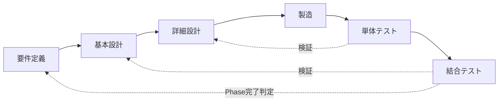

# AFK GAME — 開発工程定義書

> プロジェクト概要は [CLAUDE.md](../CLAUDE.md) を参照。本書は AFK GAME の開発工程（要件定義〜結合テスト）と、各工程の成果物・完了基準・テスト標準を定義する。

---

## 1. 目的と適用範囲

- 開発を **要件定義 → 基本設計 → 詳細設計 → 製造 → 単体テスト → 結合テスト** の6工程で管理する
- 適用範囲は AFK GAME の全開発（Phase 1〜5）
- 既存ドキュメントのディレクトリ構成は変更せず、本書で各工程への対応付けを行う

## 2. 工程モデル

### 2.1 全体構造（V字モデル）

- 単体テストは**詳細設計**（アルゴリズム・数値・分岐）を検証する
- 結合テストは**基本設計**（API設計・画面遷移・データ構造）を検証する
- Phase完了判定が**要件定義**（ゲーム仕様の実現）を検証する

### 2.2 適用単位（Phase単位の反復）

要件定義・基本設計は全Phase分を一括で確定済み（「仕様は全Phase確定 → 実装は段階的」の方針）。詳細設計以降を Phase 単位で反復する。

| 工程 | 適用単位 | 状態 |
|------|---------|------|
| 要件定義 | 全Phase一括 | ほぼ完了（未確定仕様は open_specs.md で差分管理） |
| 基本設計 | 全Phase一括 | 完了（変更時は差分更新） |
| 詳細設計 | Phase単位 | Phase単位で数値・アルゴリズムを確定 |
| 製造 | Phase単位 | フロントエンド＋バックエンド同時開発 |
| 単体テスト | Phase単位 | 製造と並行可（同一変更内での完結を推奨） |
| 結合テスト | Phase単位 | Phase完了ゲート |

## 3. 工程定義

### 3.1 要件定義

| 項目 | 内容 |
|------|------|
| 目的 | ゲームとして「何を作るか」を確定する |
| 主な作業 | ゲームシステム・バランス・UI要件の定義、未確定仕様の解消 |
| 成果物 | [docs/design/game_spec.md](design/game_spec.md)、[docs/glossary.md](glossary.md)、[docs/open_specs.md](open_specs.md)（未確定管理） |
| 完了基準 | open_specs.md の対象項目がすべて解消され、game_spec.md に反映されている |
| レビュー | `/doc-review` → 指摘は `/fix-specs` で反映 |

### 3.2 基本設計（ハイレベル設計）

| 項目 | 内容 |
|------|------|
| 目的 | システム構造・API・データモデル・画面構成を確定する |
| 主な作業 | アーキテクチャ設計、API一覧定義、DB設計、画面遷移設計 |
| 成果物 | [docs/tech/tech_spec.md](tech/tech_spec.md)（API設計・データ構造・アーキテクチャ）、[diagrams/](../diagrams/) 6点（ER図・クラス図・画面遷移図・戦闘フロー図・システム構成図・APIシーケンス図）、[docs/tech/tech_auth.md](tech/tech_auth.md)（認証方式） |
| 完了基準 | 仕様書・設計図間の矛盾がない（`/diagrams-review` の指摘解消） |
| レビュー | `/diagrams-review`、`/doc-review` |

### 3.3 詳細設計（ローレベル設計）

| 項目 | 内容 |
|------|------|
| 目的 | 対象Phaseの機能を「実装可能な粒度」まで具体化する |
| 主な作業 | 処理フロー・アルゴリズム・計算式の定義、マスターデータの数値確定 |
| 成果物 | [docs/tech/tech_battle_offline.md](tech/tech_battle_offline.md)（戦闘・オフライン計算アルゴリズム）、[docs/data/master_data.md](data/master_data.md)、[docs/data/towers/](data/towers/)・[docs/data/skills/](data/skills/)（数値定義） |
| 完了基準 | 対象Phase機能の数値・計算式・分岐条件が仕様書から一意に実装できる（数値は仮置き可、ただし「仮置き」と明記） |
| レビュー | `/doc-review`（詳細仕様の整合確認） |

### 3.4 製造

| 項目 | 内容 |
|------|------|
| 目的 | 詳細設計に基づく実装 |
| 主な作業 | backend/（FastAPI）・frontend/（Vue 3）の実装 |
| 成果物 | 実装コード一式 |
| 規約 | 既存コード規約に従う（スキーマは CamelModel、スキーマは `schemas/` に配置、ロジックは `services/` に集約、ログは logging_config 準拠 等） |
| 完了基準 | 対象機能の実装完了、`/backend-review`・`/frontend-review`・`/full-review` の指摘対応完了 |
| レビュー | `/backend-review`、`/frontend-review`、`/full-review`（仕様との整合） |

### 3.5 単体テスト

| 項目 | 内容 |
|------|------|
| 目的 | 詳細設計どおりに各モジュールが動作することを検証する |
| 対象 | バックエンド（`services/`・`master_data/`・`routers/` の関数・分岐） |
| フレームワーク | pytest + pytest-cov |
| 配置 | `backend/tests/unit/` |
| カバレッジ基準 | **C1（分岐網羅）100%**: `pytest --cov=app --cov-branch --cov-fail-under=100` |
| 除外規則 | `# pragma: no cover` の使用は理由コメント必須（例: `if __name__ == "__main__"` 等の起動コードのみ許容） |
| 完了基準 | 全テストPASS かつ C1カバレッジ100% |

- 乱数を含むロジック（ダメージ分散・ドロップ抽選・エンカウント抽選）は乱数を固定（`random.seed` / モック）して分岐を網羅する
- フロントエンドの単体レベル検証は Playwright（§3.6）に統合する（型検証は `vue-tsc` を製造工程で実施）

### 3.6 結合テスト

| 項目 | 内容 |
|------|------|
| 目的 | 基本設計どおりにAPI・画面が連携して動作することを検証する |
| レイヤー1: API統合テスト | FastAPI TestClient + SQLite実DB。認証→塔選択→tick→報酬などのAPIシーケンスを検証。配置: `backend/tests/integration/` |
| レイヤー2: E2Eテスト | **Playwright**。フロントエンド＋バックエンドを通しで起動し、画面操作ベースで検証。配置: `frontend/tests/e2e/` |
| シナリオの導出元 | [diagrams/screen_transition.md](../diagrams/screen_transition.md)（画面遷移図）、[diagrams/api_sequence.md](../diagrams/api_sequence.md)（APIシーケンス図） |
| 完了基準 | 対象Phaseの主要シナリオが全PASS |

## 4. 工程ゲート

| ゲート | タイミング | 判定手段 |
|-------|----------|---------|
| 仕様確定ゲート | 要件・詳細設計の変更時 | `/doc-review` 指摘ゼロ、open_specs.md 対象項目解消 |
| 設計整合ゲート | 基本設計の変更時 | `/diagrams-review` 指摘ゼロ |
| 製造完了ゲート | 実装完了時 | コードレビュー指摘対応 + `vue-tsc` 型チェックPASS |
| 単体テストゲート | 製造完了後 | 全PASS + C1カバレッジ100% |
| Phase完了ゲート | 結合テスト完了時 | API統合テスト・E2E全PASS + `/full-review` で仕様との乖離ゼロ |

## 5. 現在の工程状況（2026-08-01時点）

| Phase | 詳細設計 | 製造 | 単体テスト | 結合テスト |
|-------|---------|------|-----------|-----------|
| Phase 1 (MVP) | 完了 | 完了 | **未整備（遡及対象）** | **未整備（遡及対象）** |
| Phase 2 | 完了 | 進行中（装備・複数塔・ショップ・認証は実装済み） | 未着手 | 未着手 |
| Phase 3〜5 | 完了（数値は仮置き） | 未着手 | — | — |

- Phase 1〜2 の実装済み機能はテストの**遡及整備**を行う。Phase 2 の Phase完了ゲート通過までに単体・結合テストを整備すること
- テスト基盤（pytest / pytest-cov / Playwright）の導入は Phase 2 テスト工程の最初のタスクとする

## 6. 変更管理

- 未確定仕様・仕様変更は [docs/open_specs.md](open_specs.md) で管理する（現行フロー維持）
- 確定 → 該当工程の成果物（仕様書・設計図）へ反映 → 各ファイルの変更履歴に追記 → open_specs.md を更新
- 実装と仕様の乖離は `/full-review` で検出し、「仕様書を実装に合わせる」か「実装を修正する」かを都度判断して記録する

---

## 7. 変更履歴

| 日付 | 内容 |
|------|------|
| 2026-08-01 | 初版作成: 6工程（要件定義→基本設計→詳細設計→製造→単体テスト→結合テスト）の定義、V字モデル・Phase単位反復の採用、テスト標準の制定（バックエンド: pytest C1カバレッジ100%、フロントエンド: Playwright E2E、API統合: FastAPI TestClient） |
