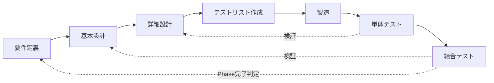

# AFK GAME — 開発工程定義書

> プロジェクト概要は [README.md](../README.md) を参照。本書は AFK GAME の開発工程（要件定義〜結合テスト）の管理体系（工程モデル・ゲート・現況・変更管理）を定義する。各工程の定義は [process/phases.md](process/phases.md)。

---

## 1. 目的と適用範囲

- 開発を **要件定義 → 基本設計 → 詳細設計 → テストリスト作成 → 製造 → 単体テスト → 結合テスト** の7工程で管理する
- 製造は **TDD（テスト駆動開発）** で進める。適用範囲はバックエンドのみ（[process/phases.md](process/phases.md) §3.4）
- 適用範囲は AFK GAME の全開発（Phase 1〜5）
- 各工程の成果物（Markdown）の記述規約（文字数上限・分割ルール）は [documentation_rules.md](documentation_rules.md) に従う

## 2. 工程モデル

### 2.1 全体構造（V字モデル）

- テストリストは詳細設計の**分岐一覧**から導出する。テストが先、実装が後（TDD）
- 単体テストは**詳細設計**（アルゴリズム・数値・分岐）を検証する
- 結合テストは**基本設計**（API設計・画面遷移・データ構造）を検証する
- Phase完了判定が**要件定義**（ゲーム仕様の実現）を検証する

### 2.2 適用単位（Phase単位の反復）

要件定義・基本設計は全Phase分を一括で確定済み（「仕様は全Phase確定 → 実装は段階的」の方針）。詳細設計以降を Phase 単位で反復する。

| 工程 | 適用単位 | 状態 |
|------|---------|------|
| 要件定義 | 全Phase一括 | 完了（未確定は `open_specs.md` 管理） |
| 基本設計 | 全Phase一括 | 完了（変更時は差分更新） |
| 詳細設計 | Phase単位 | Phase単位で数値・アルゴリズムを確定 |
| テストリスト作成 | 機能単位 | 分岐一覧を失敗するテストへ落とす（バックエンドのみ） |
| 製造 | 機能単位 | TDDで実装。フロントエンドは従来どおり |
| 単体テスト | Phase単位 | C1網羅の測定と補完（同一変更内での完結を推奨） |
| 結合テスト | Phase単位 | Phase完了ゲート |

### 2.3 工程とスキルの対応

各工程には**手順を統一するスキル**が1件ずつある。工程の作業はスキル経由で行う。
一般手順は `.claude/skills/`、固有の値は `.claude/project/` に分離（索引: [INDEX.md](../.claude/project/INDEX.md)）。

| 工程 | 工程スキル | ゲートスキル |
|------|----------|------------|
| 要件定義 | `requirements`（+ `resolve-specs`） | `doc-review` → `fix-specs` |
| 基本設計 | `basic-design` | `diagrams-review`、`doc-review` |
| 詳細設計 | `detail-design` | `doc-review` |
| テストリスト作成 | `test-list` | （Red確認は工程内） |
| 製造 | `dev` | `backend-review`、`frontend-review` |
| 単体テスト | `unit-test` | （C1 100%は工程内） |
| 結合テスト | `integration-test` | `full-review` |

**各工程スキルは工程内検証を持つ**（機械的検証 → 読んで確認 → 矛盾時の対応）。
横断レビューへ丸投げせず、その工程で潰せる矛盾は工程内で解消してからゲートへ渡す。機械的検証は常設スクリプト（`scripts/check_*.py`）を優先する。

## 3. 工程定義

各工程（§3.1 要件定義 〜 §3.7 結合テスト）の目的・成果物・完了基準・テスト標準は [process/phases.md](process/phases.md) で定義する（節番号 §3.x は分割後も維持）。

## 4. 工程ゲート

| ゲート | タイミング | 判定手段 |
|-------|----------|---------|
| 仕様確定ゲート | 要件・詳細設計の変更時 | `doc-review` 指摘ゼロ、`check_docs.py` exit 0、`open_specs.md` の未解消が対象Phaseの期限内 |
| ドキュメント規約ゲート | 仕様書・設計図の変更時 | `python scripts/check_doc_size.py` が `違反 0`（exit 0） |
| 設計整合ゲート | 基本設計の変更時 | `diagrams-review` 指摘ゼロ（仕様確定ゲートと並走し、修正は1パスに統合） |
| テストリストゲート | 製造着手前 | 分岐一覧の全項目にテストが存在し（`check_branch_list.py --tests` で照合）、実行して全件 FAIL（Red）を確認 |
| 製造完了ゲート | 実装完了時 | テスト全PASS（Green）+ コードレビュー指摘対応 + `vue-tsc` 型チェックPASS |
| 単体テストゲート | 製造完了後 | 全PASS + C1カバレッジ100% |
| Phase完了ゲート | 結合テスト完了時 | API統合テスト・E2E全PASS + `full-review` で仕様との乖離ゼロ |

## 5. 現在の工程状況（2026-08-05時点）

| Phase | 詳細設計 | 製造 | 単体テスト | 結合テスト |
|-------|---------|------|-----------|-----------|
| Phase 1 (MVP) | 完了 | 完了 | **完了（C1 100%）** | **完了（L1・L2）** |
| Phase 2 | 完了 | **完了**（日替わりショップ含む全機能。製造完了ゲートの初回レビュー指摘 backend 18件・frontend 12件を反映済み） | **完了（C1 100%）** | **完了（L1・L2）** |
| Phase 3 | **完了**（分岐一覧まで整備。数値は仮置き。お知らせのAPI定義のみ基本設計待ち → [tech_api.md](tech/tech_api.md)「お知らせ」） | 未着手 | — | — |
| Phase 4〜5 | 完了（数値は仮置き。分岐一覧は各Phase着手時に整備） | 未着手 | — | — |

- テスト基盤は導入済み（pytest / pytest-cov、Playwright）。Phase 1〜2 は**遡及整備**で完了

### 5.1 単体テストの整備状況（C1カバレッジ）

**単体テストゲート通過（2026-08-03 レビュー指摘反映後に再測定）**: `app/` 全42モジュールが C1 100%、402件 PASS（単体373・結合29）、1,819 stmts / 308 branches。`# pragma: no cover` の使用はゼロ。

- 数値は `pytest` 実行時に更新する。製造の追加・変更時は同一変更内で100%を維持する

### 5.2 TDDの適用範囲

- TDD（[process/phases.md](process/phases.md) §3.4〜§3.5）は**新規実装から適用**する。Phase 2 の残り（日替わりショップ）と Phase 3〜5 が対象
- 実装済み（Phase 1〜2）のテストは遡及整備で C1 100% に到達済みのため、**書き直さない**
- 既存機能の修正・リファクタ時は、先に**その変更を表すテストを追加**してから実装に着手する

### 5.3 結合テストの整備状況

**L1（API統合）29件 PASS・L2（E2E）13件 PASS（2026-08-03）**。必須シナリオ7件（[.claude/project/integration-test.md](../.claude/project/integration-test.md) §3）を全てカバー。

- L1 は実装済み25エンドポイントのうち24へ到達（未到達は501を返す `POST /api/auth/google` のみ）、L2 は全6ルートへ到達
- 外部要因は固定する（乱数=固定シード、時刻=`last_tick_at` の巻き戻し）。スリープで待たない
- 検出した乖離は [known_issues.md](known_issues.md) へ記録し、テストの期待値を実装へ寄せない

## 6. 変更管理

- 未確定仕様・仕様変更は [open_specs.md](open_specs.md) で管理する。**原則ゼロ**とし、生じた場合のみ作成・登録する（不在＝未確定ゼロ）
- 確定 → 成果物（仕様書・設計図）へ反映 → [changelog.md](changelog.md) に追記 → open_specs.md から削除（全解消でファイルごと削除）
- **仕様は確定済みで数値のみ調整待ち**の項目は [docs/balance_backlog.md](balance_backlog.md) で管理する。実装をブロックしないため open_specs.md には残さず、結合テスト〜リリース後の実測で確定する
- **実装側の疑義**（仕様との乖離・デッドコード・規約違反）は [docs/known_issues.md](known_issues.md) で管理する。対応時は「仕様書を実装に合わせる」か「実装を修正する」かを都度判断する
- **重複記載の解消時**は正を1ファイルに決め、[spec_ownership.md](spec_ownership.md) で宣言する（`check_docs.py --owner` が逸脱を検出）
- 実装と仕様の乖離は `full-review` スキルで検出し、上記フローで記録する
