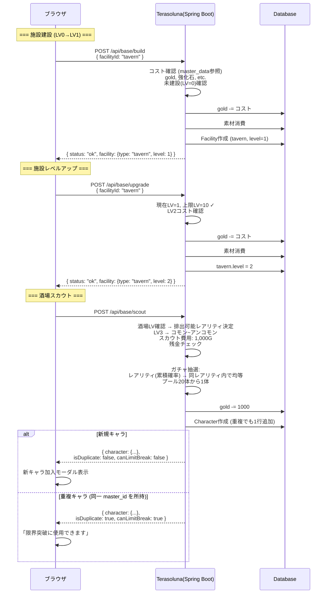
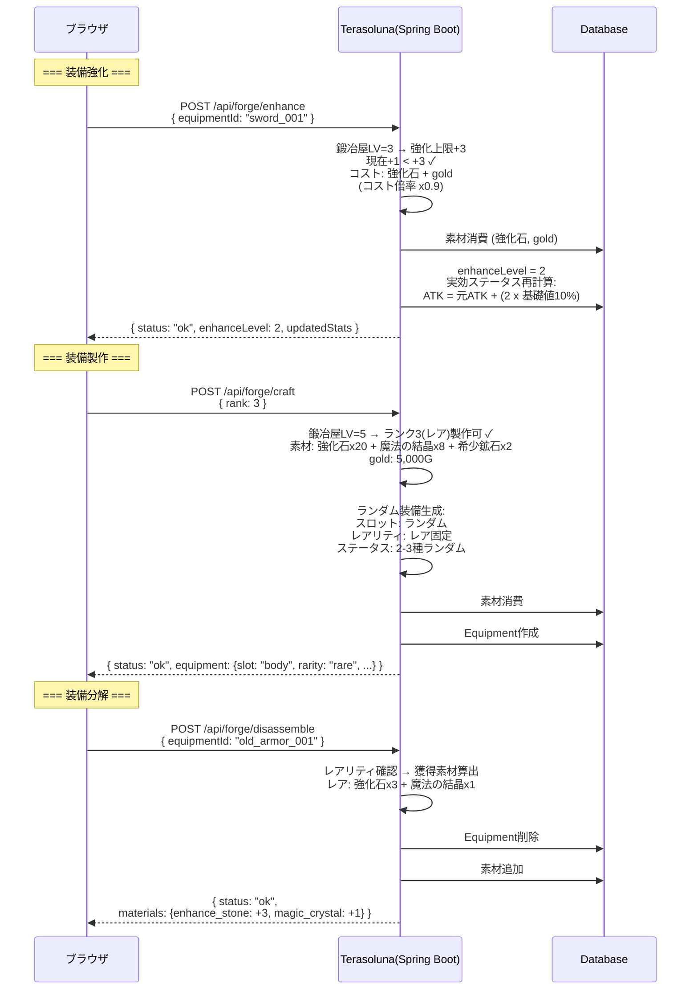

# APIシーケンス図 — 施設・鍛冶屋（Phase 4）

> 親: [api_sequence.md](../api_sequence.md)。API定義は [tech_api.md](../../tech/basic/tech_api.md)。

## 9. 施設建設・レベルアップ（Phase 4）

```mermaid
%%{init: {'theme': 'default', 'sequence': {'actorFontSize': 18, 'messageFontSize': 16, 'noteFontSize': 14}} }%%
sequenceDiagram
    participant B as ブラウザ
    participant API as Terasoluna(Spring Boot)
    participant DB as Database

    Note over B: === 施設建設 (LV0→LV1) ===

    B->>API: POST /api/base/build<br/>{ facilityId: "tavern" }

    API->>API: コスト確認 (master_data参照)<br/>gold, 強化石, etc.<br/>未建設(LV=0)確認

    API->>DB: gold -= コスト
    API->>DB: 素材消費
    API->>DB: Facility作成 (tavern, level=1)
    API-->>B: { status: "ok", facility: {type: "tavern", level: 1} }

    Note over B: === 施設レベルアップ ===

    B->>API: POST /api/base/upgrade<br/>{ facilityId: "tavern" }

    API->>API: 現在LV=1, 上限LV=10 ✓<br/>LV2コスト確認

    API->>DB: gold -= コスト
    API->>DB: 素材消費
    API->>DB: tavern.level = 2
    API-->>B: { status: "ok", facility: {type: "tavern", level: 2} }

    Note over B: === 酒場スカウト ===

    B->>API: POST /api/base/scout

    API->>API: 酒場LV確認 → 排出可能レアリティ決定<br/>LV3 → コモン~アンコモン<br/>スカウト費用: 1,000G<br/>残金チェック

    API->>API: ガチャ抽選:<br/>レアリティ(累積確率) → 同レアリティ内で均等<br/>プール20体から1体

    API->>DB: gold -= 1000
    API->>DB: Character作成 (重複でも1行追加)

    alt 新規キャラ
        API-->>B: { character: {...},<br/>  isDuplicate: false, canLimitBreak: false }
        B->>B: 新キャラ加入モーダル表示
    else 重複キャラ (同一 master_id を所持)
        API-->>B: { character: {...},<br/>  isDuplicate: true, canLimitBreak: true }
        B->>B: 「限界突破に使用できます」
    end
```

## 10. 鍛冶屋操作フロー（Phase 4）

```mermaid
%%{init: {'theme': 'default', 'sequence': {'actorFontSize': 18, 'messageFontSize': 16, 'noteFontSize': 14}} }%%
sequenceDiagram
    participant B as ブラウザ
    participant API as Terasoluna(Spring Boot)
    participant DB as Database

    Note over B: === 装備強化 ===

    B->>API: POST /api/forge/enhance<br/>{ equipmentId: "sword_001" }

    API->>API: 鍛冶屋LV=3 → 強化上限+3<br/>現在+1 < +3 ✓<br/>コスト: 強化石 + gold<br/>(コスト倍率 x0.9)

    API->>DB: 素材消費 (強化石, gold)
    API->>DB: enhanceLevel = 2<br/>実効ステータス再計算:<br/>ATK = 元ATK + (2 x 基礎値10%)
    API-->>B: { status: "ok", enhanceLevel: 2, updatedStats }

    Note over B: === 装備製作 ===

    B->>API: POST /api/forge/craft<br/>{ rank: 3 }

    API->>API: 鍛冶屋LV=5 → ランク3(レア)製作可 ✓<br/>素材: 強化石x20 + 魔法の結晶x8 + 希少鉱石x2<br/>gold: 5,000G

    API->>API: ランダム装備生成:<br/>スロット: ランダム<br/>レアリティ: レア固定<br/>ステータス: 2-3種ランダム
    API->>DB: 素材消費
    API->>DB: Equipment作成
    API-->>B: { status: "ok", equipment: {slot: "body", rarity: "rare", ...} }

    Note over B: === 装備分解 ===

    B->>API: POST /api/forge/disassemble<br/>{ equipmentId: "old_armor_001" }

    API->>API: レアリティ確認 → 獲得素材算出<br/>レア: 強化石x3 + 魔法の結晶x1

    API->>DB: Equipment削除
    API->>DB: 素材追加
    API-->>B: { status: "ok",<br/>  materials: {enhance_stone: +3, magic_crystal: +1} }
```
