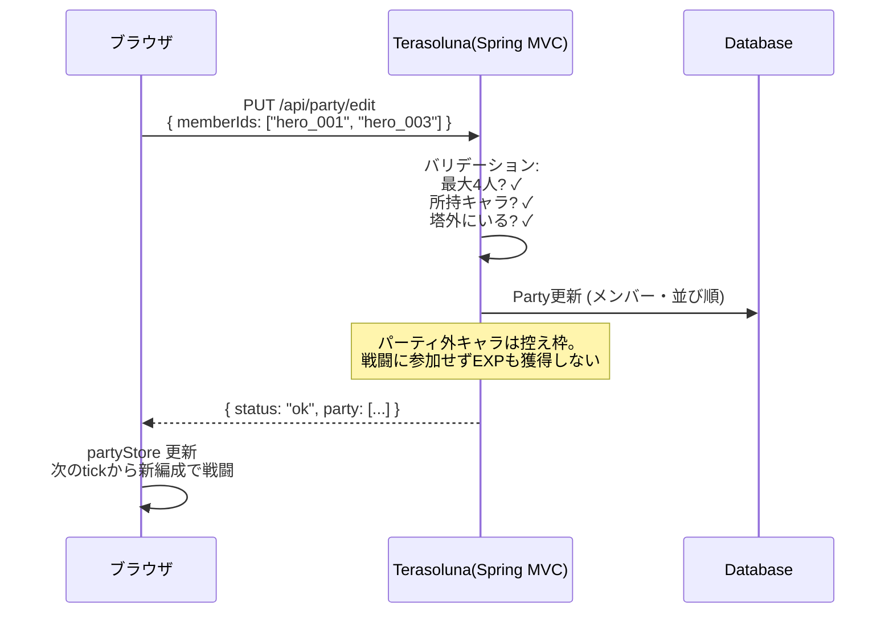
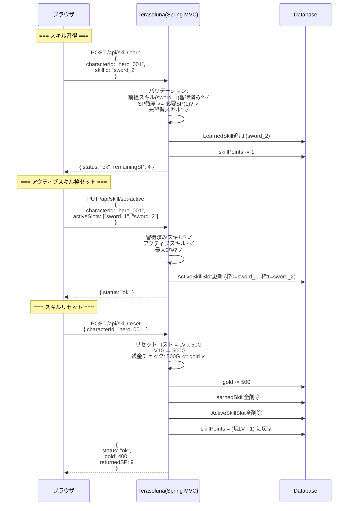
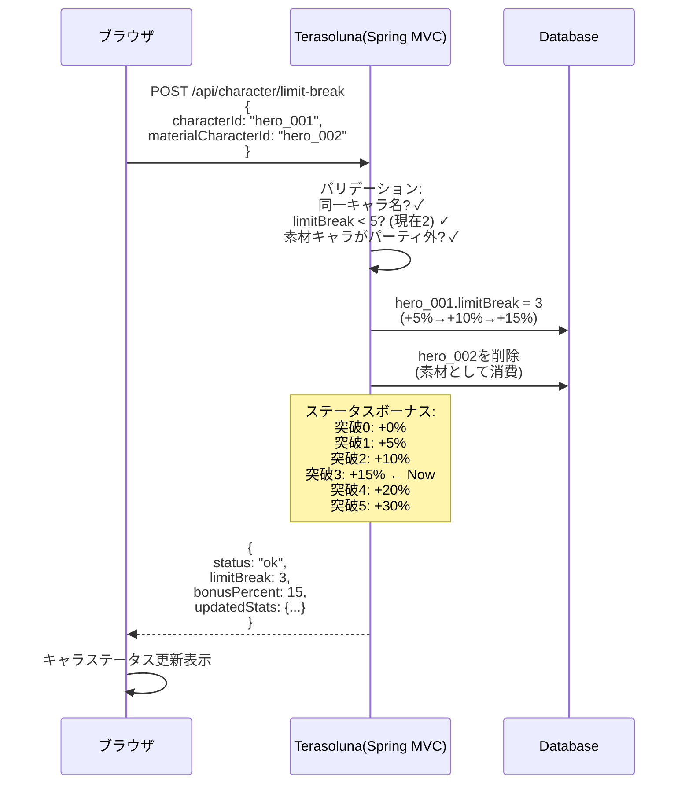

# APIシーケンス図 — パーティ・スキル・限界突破（Phase 3）

> 親: [api_sequence.md](../api_sequence.md)。API定義は [tech_api.md](../../tech/basic/tech_api.md)。

## 6.5. パーティ編成フロー（Phase 3）

- 編成ルール（最大4人・控え枠・入れ替えは塔外のみ）は [systems/character.md](../../design/systems/character.md) §2.7 が正

## 7. スキル習得・リセットフロー（Phase 3）

## 8. 限界突破フロー（Phase 3）

