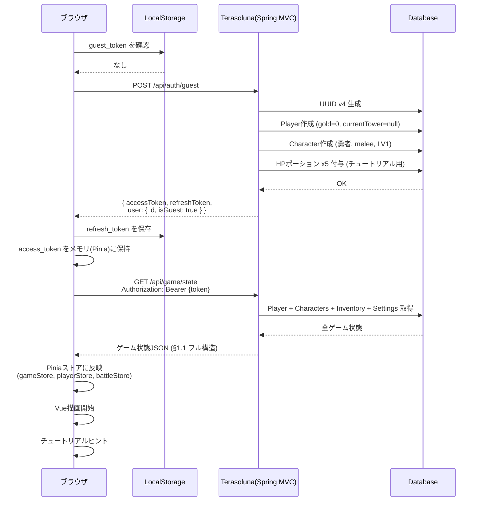
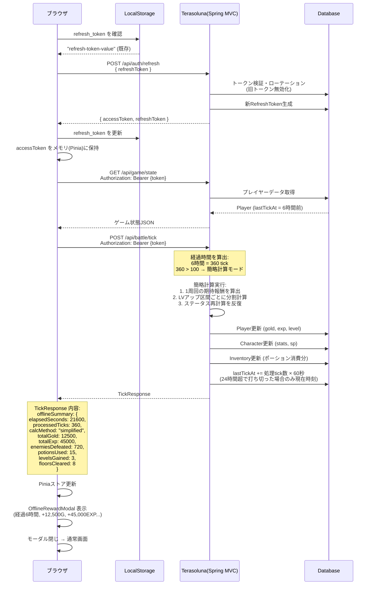
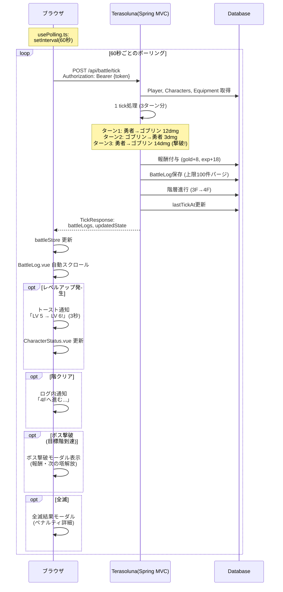
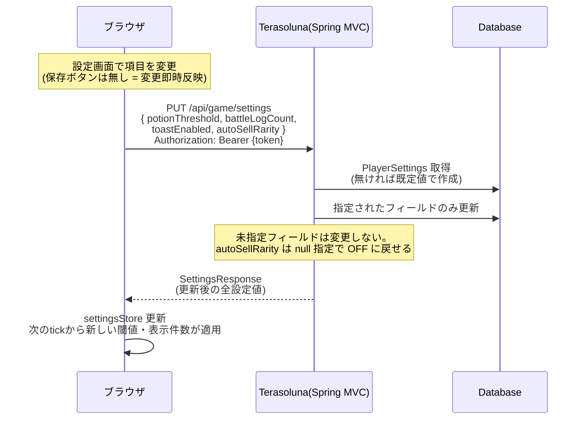
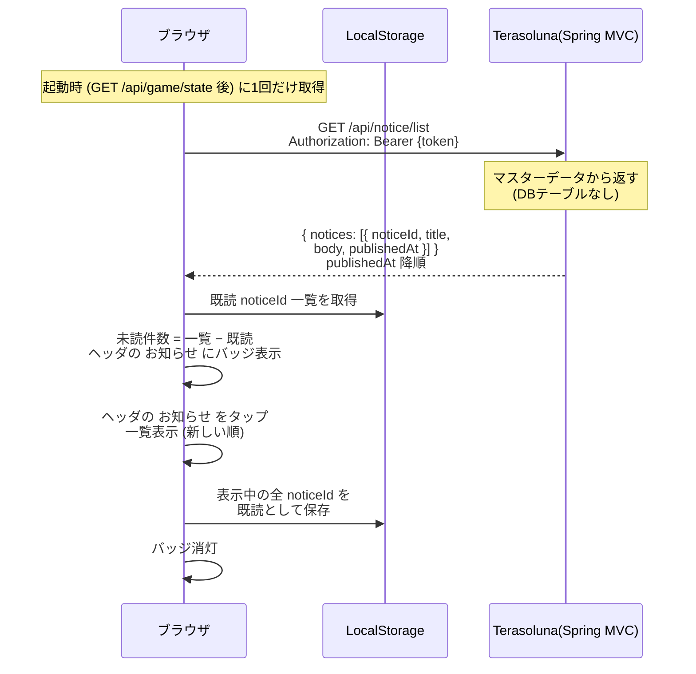
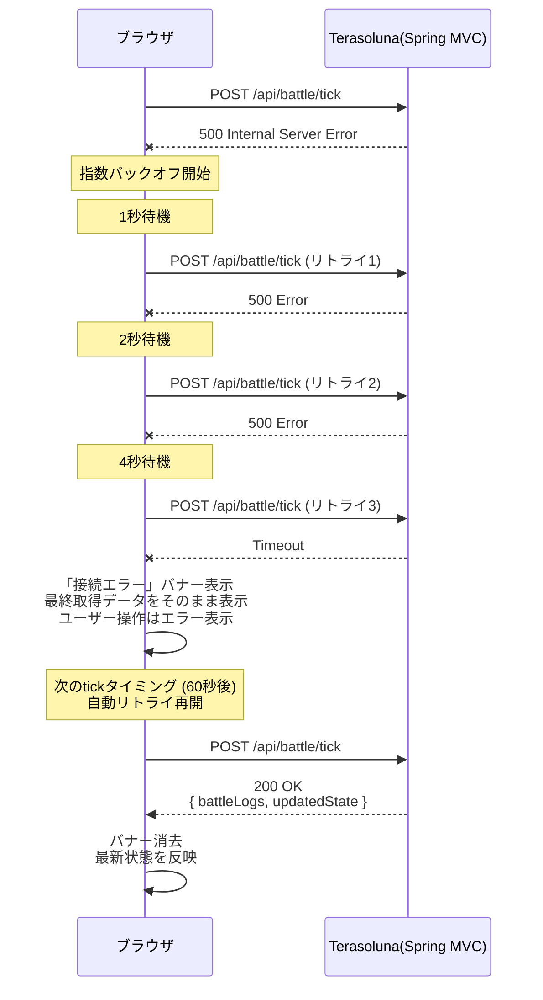

# APIシーケンス図 — 基本ループ

> 親: [api_sequence.md](../api_sequence.md)。API定義は [tech_api.md](../../tech/basic/tech_api.md)。

## 1. 初回アクセス（ゲスト作成 — Phase 1）

## 2. 再訪問（オフライン復帰）

## 3. オンライン中（ポーリングループ）

## 3.5. 設定変更（Phase 1〜）

- 設定はサーバー側に保存する（[systems/ui.md](../../design/systems/ui.md) 設定画面）。画面遷移は [screen_transition/main_nav.md](../screen_transition/main_nav.md) の設定画面

## 3.7. お知らせ確認（Phase 3〜）

- API定義は `tech_api/core.md`「お知らせ」。要件・既読保持先の正は [operation_requirements.md](../../design/requirements/operation_requirements.md) §3.1（サーバーは既読状態を持たない）
- 画面遷移は `screen_transition/main_nav.md` の お知らせ画面

## 13. 通信エラー時（リトライ）

