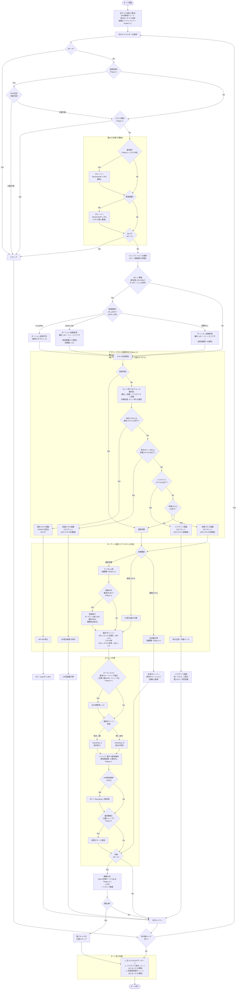

# 戦闘フロー — 1ターンの処理

> 親: [battle_flow.md](../battle_flow.md)。処理詳細は [tech_battle.md](../../tech/detail/tech_battle.md)。

## 1ターンの処理フロー

```mermaid
%%{init: {'theme': 'default', 'themeVariables': {'fontSize': '16px'}} }%%
flowchart TD
    Start([ターン開始]) --> Sort["全キャラ(味方+敵)を\nSPD降順でソート\n同SPD: キャラID順\n(複数パーティメンバー: Phase 3~)"]
    Sort --> NextChar["次のキャラクターを取得"]

    NextChar --> DeadCheck{HP = 0?}
    DeadCheck -->|Yes| SkipChar["スキップ"]
    DeadCheck -->|No| ParaCheck{"麻痺状態?\nPhase 3~"}

    ParaCheck -->|Yes| ParaRoll{"30%判定:\n行動不能?"}
    ParaRoll -->|行動不能| SkipChar
    ParaRoll -->|行動可能| StunCheck
    ParaCheck -->|No| StunCheck

    StunCheck{"スタン状態?\nPhase 3~"}
    StunCheck -->|Yes| SkipChar
    StunCheck -->|No| PoisonDOT

    subgraph DOT["毒DOT処理 (行動前)"]
        PoisonDOT{"毒状態?\nPhase 3~ (スキル毒)"}
        PoisonDOT -->|Yes| ApplyPoison["ダメージ =\nfloor(maxHP x 5%)\n最低1"]
        PoisonDOT -->|No| EnvDOT
        ApplyPoison --> EnvDOT

        EnvDOT{"環境毒霧?"}
        EnvDOT -->|Yes| ApplyEnvDOT["ダメージ =\nfloor(maxHP x 2%)\n(スキル毒と重複)"]
        EnvDOT -->|No| DOTDeath
        ApplyEnvDOT --> DOTDeath

        DOTDeath{DOTで\nHP = 0?}
    end

    DOTDeath -->|Yes| SkipChar
    DOTDeath -->|No| Regen

    Regen["パッシブ: リジェネ適用\n(ターン開始時HP回復)"]
    Regen --> PotionCheck

    PotionCheck{"HP <= 閾値\n(設定値 10%-50%)?\nかつポーション所持?"}
    PotionCheck -->|Yes| EnvRestrict
    PotionCheck -->|No| SkillEntry

    EnvRestrict{"環境制限?\n(no_potion /\npotion_half)"}
    EnvRestrict -->|no_potion| PotionBlocked["ポーション使用不可\n(使用せずスキップ)"]
    EnvRestrict -->|potion_half| HalfPotion["ポーション自動使用\n優先: HP < ハイ < エリクサー\n(低回復量から使用)\n回復量 x 0.5"]
    EnvRestrict -->|制限なし| UsePotion["ポーション自動使用\n優先: HP < ハイ < エリクサー\n(低回復量から使用)"]
    PotionBlocked --> SkillEntry
    HalfPotion --> SkillEntry
    UsePotion --> SkillEntry

    subgraph SkillJudge["アクティブスキル発動判定 (Phase 3~)\n敵はPhase 1-4は通常攻撃のみ\n(敵スキル: Phase 5~ ボスラッシュ強化ボスから)"]
        SkillEntry["スキル判定開始"]
        SkillEntry --> SilenceCheck{"沈黙状態?"}
        SilenceCheck -->|Yes| NormalAtk["通常攻撃"]
        SilenceCheck -->|No| CheckSlots

        CheckSlots["セット枠2つをチェック\n優先度:\n蘇生 > 回復 > バフ/デバフ > 攻撃\n同優先度: セット枠1を優先"]

        CheckSlots --> ReviveCheck{"味方にHP=0 &\n蘇生スキルCD完了?"}
        ReviveCheck -->|Yes| UseRevive["蘇生スキル発動\nHP30%で復活\nCD=8T"]
        ReviveCheck -->|No| HealCheck

        HealCheck{"味方HP <= 40% &\n回復スキルCD完了?"}
        HealCheck -->|Yes| UseHeal["回復スキル発動\nCDリセット\n(CD=スキル定義値)"]
        HealCheck -->|No| BuffDebuffCheck

        BuffDebuffCheck{"バフ/デバフ\nスキルCD完了?"}
        BuffDebuffCheck -->|Yes| UseBuffDebuff["バフ/デバフ発動\nCDリセット\n(CD=スキル定義値)"]
        BuffDebuffCheck -->|No| AtkSkillCheck

        AtkSkillCheck{"攻撃スキル\nCD完了?"}
        AtkSkillCheck -->|Yes| UseAtkSkill["攻撃スキル発動\nCDリセット\n(CD=スキル定義値)"]
        AtkSkillCheck -->|No| NormalAtk
    end

    subgraph Target["ターゲット選択 (リアルタイム判定)"]
        UseRevive --> SelectDead["HP=0の味方"]
        UseHeal --> SelectLowHP["HP割合最低の味方"]
        UseBuffDebuff --> SelectBuff["味方全体 / 対象ルール"]
        UseAtkSkill --> SelectAtkTarget
        NormalAtk --> SelectAtkTarget

        SelectAtkTarget{"攻撃種別"}
        SelectAtkTarget -->|通常攻撃| RandTarget["ランダム1体\n(複数敵: Phase 3~)"]
        SelectAtkTarget -->|単体スキル| MaxHPTarget["HP割合最大の敵"]
        SelectAtkTarget -->|範囲スキル| AllTarget["生存敵全体\n(複数敵: Phase 3~)"]

        RandTarget --> TauntCheck{"挑発中の\n敵/味方あり?\nPhase 3~"}
        TauntCheck -->|Yes| TauntRoll["挑発率で\nターゲット振り分け\n(最大80%,\n複数時は按分)"]
        TauntCheck -->|No| DmgCalc
        TauntRoll --> DmgCalc
    end

    SelectDead --> ReviveApply["HP = maxHP x 30%"]
    SelectLowHP --> HealApply["HP回復量計算"]
    SelectBuff --> BuffApply["バフ/デバフ適用\n同一スキル: 上書き\n異スキル: 共存加算"]
    MaxHPTarget --> DmgCalc
    AllTarget --> AoECalc

    subgraph Damage["ダメージ計算"]
        DmgCalc["基本ダメージ =\nATK x (1 ± 0.1乱数) - DEF x 0.5\nスキル時:\nATK x スキル倍率 - DEF x 0.5"]

        DmgCalc --> CritCheck{"クリティカル?\n基本5% + パッシブ補正\n(合算上限100%, パッシブはPhase 3~)"}
        CritCheck -->|Yes| CritDmg["DEF減算後 x 1.5"]
        CritCheck -->|No| MinDmg

        CritDmg --> MinDmg{"最低ダメージ\n保証"}
        MinDmg -->|味方→敵| Min1["max(dmg, 1)\n詰み防止"]
        MinDmg -->|敵→味方| Min0["max(dmg, 0)\n高DEF有効"]

        Min1 --> PassiveDmgReduce
        Min0 --> PassiveDmgReduce

        PassiveDmgReduce["パッシブ: 被ダメ軽減適用\n(実効軽減率 上限80%)\nPhase 3~"]
        PassiveDmgReduce --> Lifesteal

        Lifesteal{"HP吸収装備?\n(3-8%)"}
        Lifesteal -->|Yes| ApplyLifesteal["HP += floor(dmg x 吸収率)"]
        Lifesteal -->|No| Counter
        ApplyLifesteal --> Counter

        Counter{"被攻撃側に\n反撃パッシブ?\nPhase 3~"}
        Counter -->|Yes| CounterAtk["反撃ダメージ適用"]
        Counter -->|No| DefeatCheck
        CounterAtk --> DefeatCheck
    end

    AoECalc["全体ダメージ =\n単体ダメージ x 0.7\n(各敵に適用)"] --> DefeatCheck

    ReviveApply --> NextCharCheck
    HealApply --> NextCharCheck
    BuffApply --> NextCharCheck

    DefeatCheck{"対象\nHP = 0?"}
    DefeatCheck -->|Yes| GrantReward["報酬付与:\nGold (市場ボーナス込み Phase 4~)\n+ EXP\n+ ドロップ抽選"]
    DefeatCheck -->|No| NextCharCheck

    GrantReward --> AllEnemyDead{"敵全滅?"}
    AllEnemyDead -->|Yes| SkipRemaining["残りキャラの\n行動スキップ"]
    AllEnemyDead -->|No| NextCharCheck

    SkipChar --> MoreChars
    NextCharCheck["次のキャラへ"] --> MoreChars
    SkipRemaining --> TurnEnd

    MoreChars{"未行動キャラ\nあり?"}
    MoreChars -->|Yes| NextChar
    MoreChars -->|No| TurnEnd

    subgraph TurnEndProc["ターン終了処理"]
        TurnEnd["1. 全スキルCDカウンター -1\n2. バフ/デバフ残ターン -1\n   (0になったら解除)\n3. 状態異常残ターン -1\n   (0になったら解除)"]
    end

    TurnEnd --> End([ターン終了])
```
