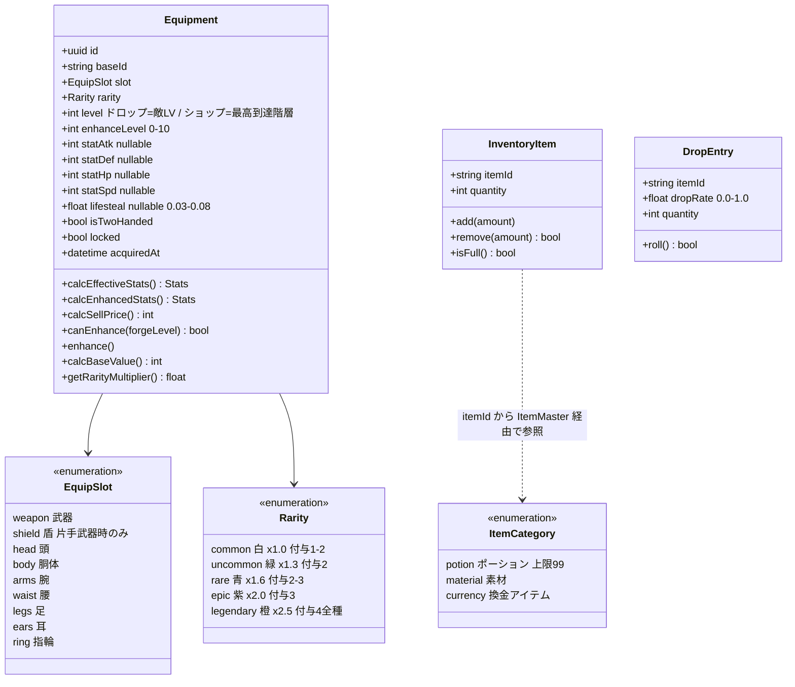
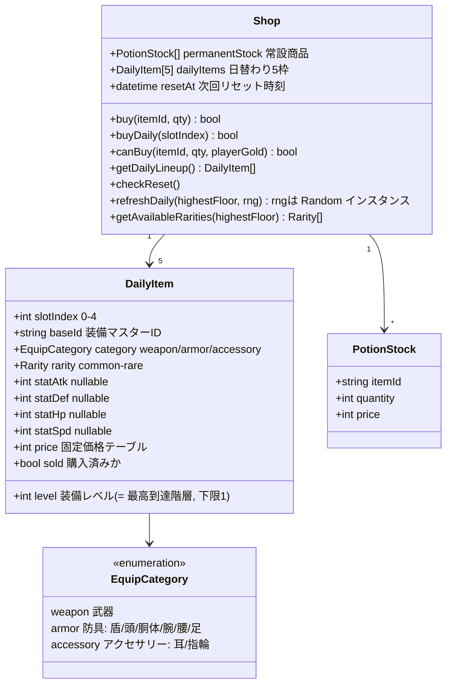
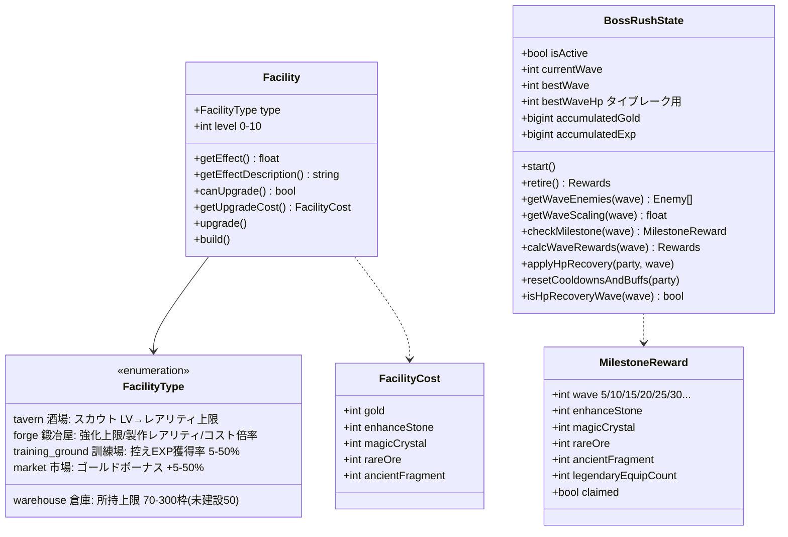

# クラス図 — 装備・アイテム・ショップ・施設

> 親: [class_diagram.md](../class_diagram.md)。仕様は [systems/equipment.md](../../design/systems/equipment.md) / [systems/economy.md](../../design/systems/economy.md)。

## 装備・アイテム

- `InventoryItem` は `category` を**自身の列として持たない**。カテゴリは `itemId` から `ItemMaster`（コード内マスターデータ）を引いて得る派生値（[er_diagram/item.md](../er_diagram/item.md)）
- `Equipment` のステータス列名は ER図・[tech_data.md](../../tech/basic/tech_data.md) と揃えて `statAtk` / `statDef` / `statHp` / `statSpd`（`Stats.atk` 等のキャラクター側ステータスと区別する）

## ショップ

- 抽選結果（レアリティ・レベル・ステータス）は生成時に確定して保存する（[tech_shop.md §5](../../tech/detail/tech_shop.md)）
- `EquipCategory`（3値）は `EquipSlot`（9値）とは別概念。カテゴリ→スロットの対応は [systems/equipment.md §2.4](../../design/systems/equipment.md)

## 施設・ボスラッシュ

