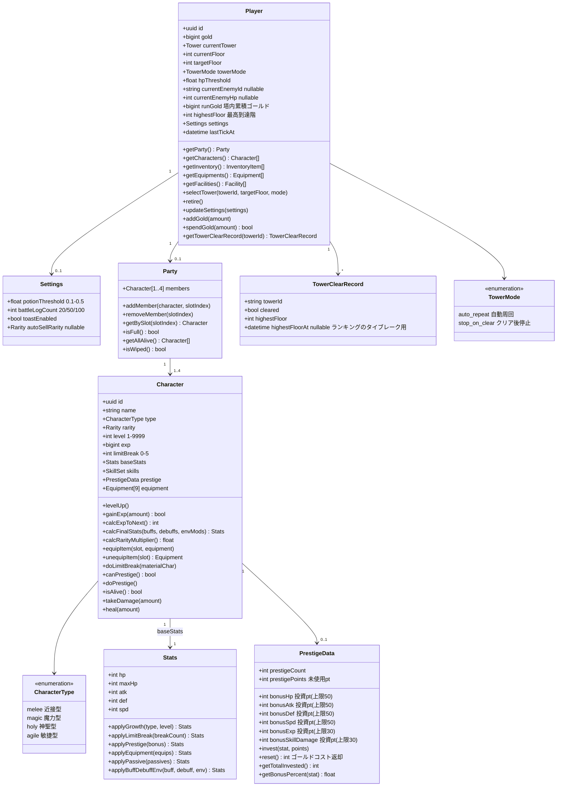
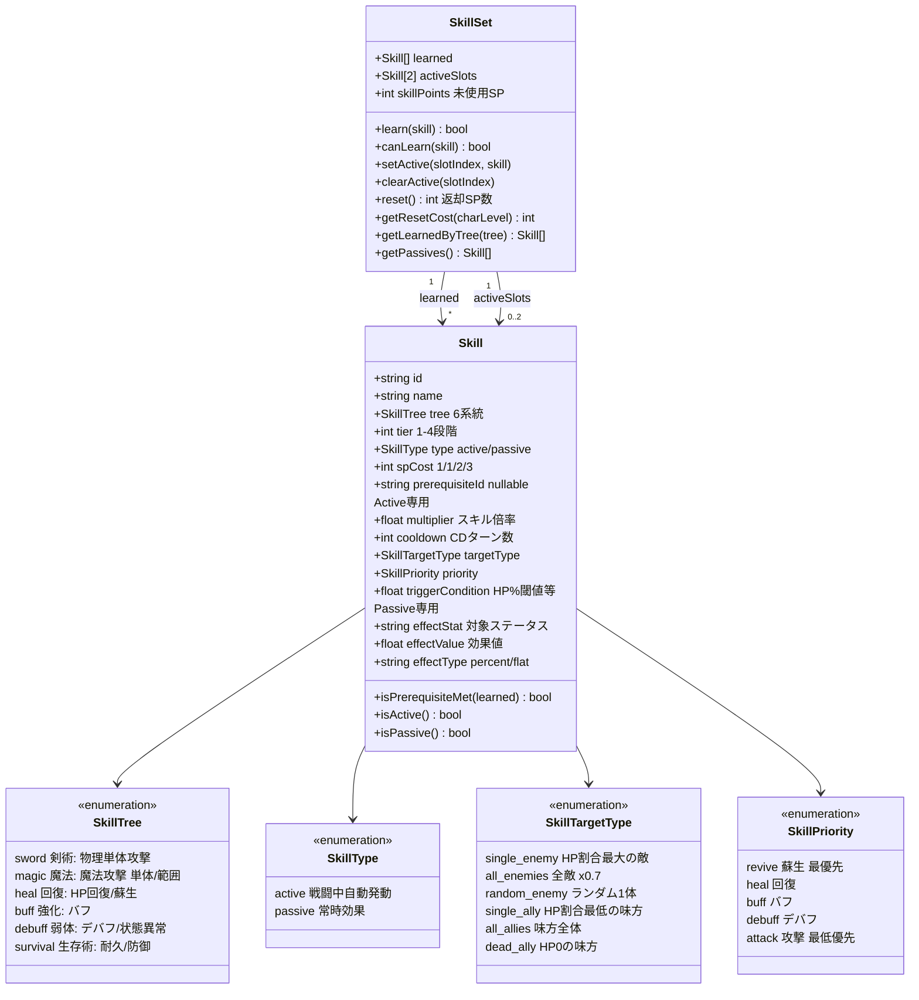

# クラス図 — プレイヤー・パーティ・キャラクター・スキル

> 親: [class_diagram.md](../class_diagram.md)。仕様は [systems/character.md](../../design/systems/character.md)。
> 本図はドメインの構造を表す。永続化スキーマの正は [tech_db/player.md](../../tech/basic/tech_db/player.md) であり、集約 `Party` は `party_members` テーブル（1メンバー1行）として持つ。

## プレイヤー・パーティ・キャラクター

## スキルシステム

