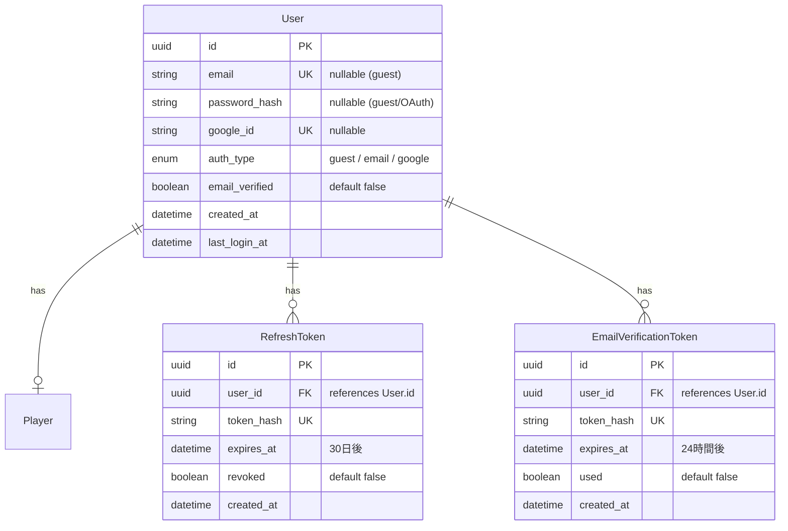
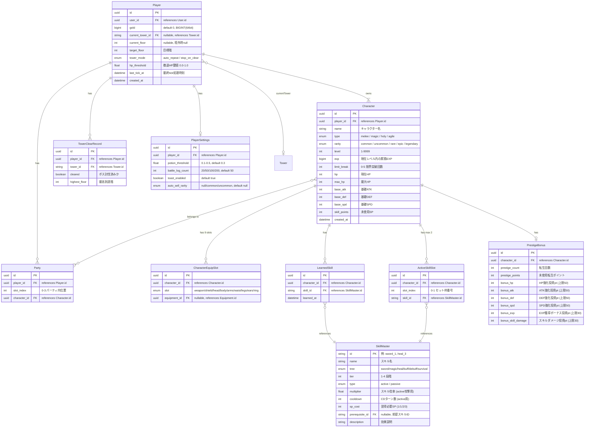
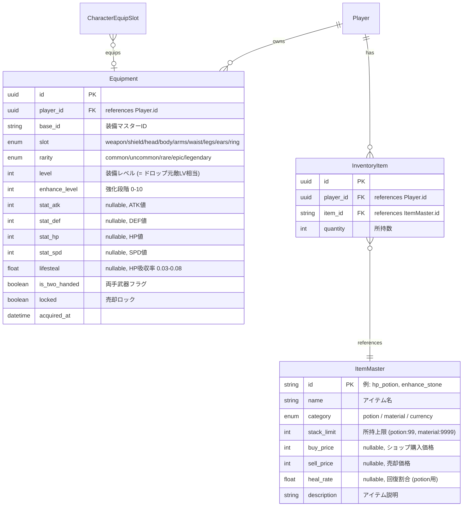
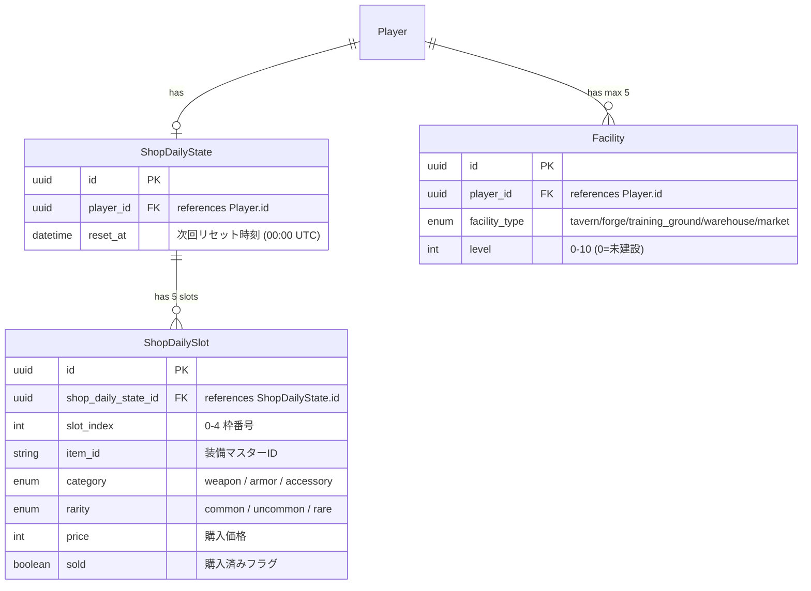
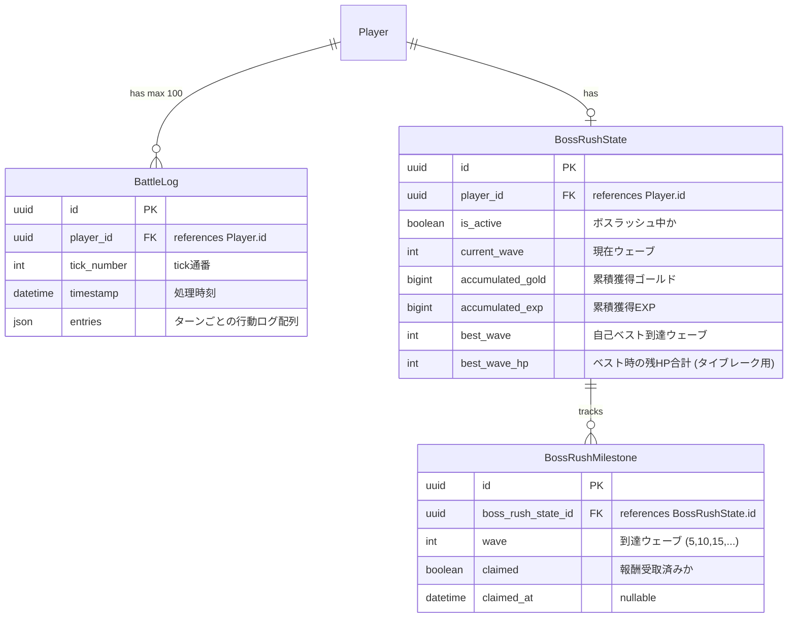
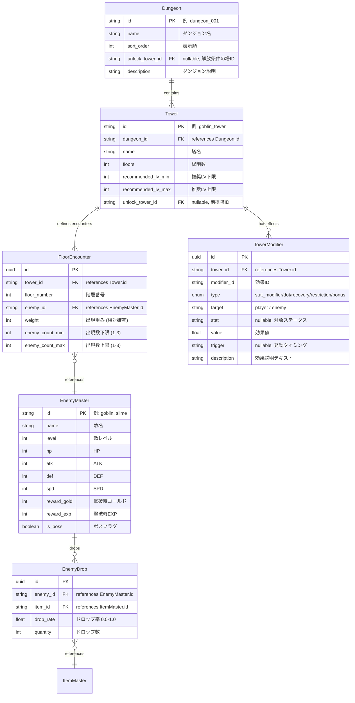

# ER図（エンティティ関連図）

> 技術仕様: [tech_spec.md](../tech/tech_spec.md) / 認証仕様: [tech_auth.md](../tech/tech_auth.md)

## 認証・アカウント系

## プレイヤー・キャラクター系

## 装備・アイテム系

## ショップ・施設系

## 戦闘・ボスラッシュ系

## ダンジョン・塔・敵系（マスターデータ）

