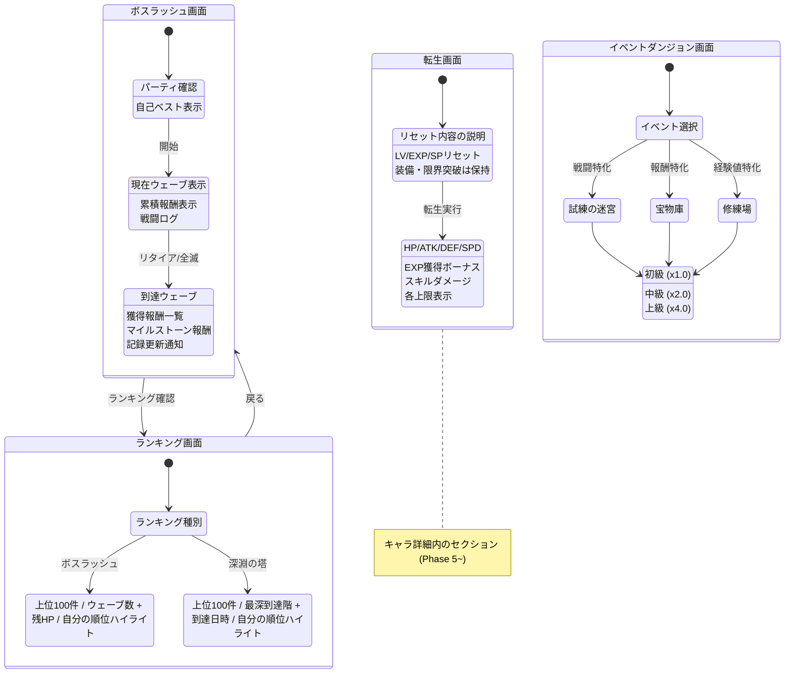

# 画面遷移図 — Phase 5 追加コンテンツ

> 親: [screen_transition.md](../screen_transition.md)。仕様は [systems/endgame.md](../../design/systems/endgame.md)、UI仕様は [systems/ui.md](../../design/systems/ui.md) §3。

## Phase 5 追加コンテンツ

- ボスラッシュ画面・イベントダンジョン画面・深淵の塔への**導線**は「探索」タブ（Phase 5 で「塔」から改称）配下のセクションとし、タブは追加しない（正は `systems/ui.md` ナビゲーション構造、タブ構成は [main_nav.md](main_nav.md)「Phase別タブ構成」）
- **転生画面はキャラ詳細内のセクション**（[main_nav.md](main_nav.md) の キャラ画面 > ステータス詳細 から入る）。Phase 5 の4機能で唯一「探索」タブ配下に置かない（正は `systems/ui.md` ナビゲーション構造）
- ランキング画面はボスラッシュ（`GET /api/boss-rush/ranking`）と深淵の塔（`GET /api/abyss/ranking`）の2種を持ち、表示項目が異なる（正は [api_sequence/endgame.md](../api_sequence/endgame.md) §11・§11.7）
