# システム構成図 — 全体アーキテクチャ

> 親: [system_architecture.md](../system_architecture.md)。技術仕様は [tech_spec.md](../../tech/tech_spec.md)、モジュール構成は [tech_backend.md](../../tech/basic/tech_backend.md) §4。

## 全体アーキテクチャ

```mermaid
%%{init: {'theme': 'default', 'themeVariables': {'fontSize': '16px'}} }%%
flowchart TB
    subgraph Client["ブラウザ (Vue.js 3 SPA + TypeScript)"]
        direction TB

        subgraph Views["Views (ページコンポーネント)"]
            GameView["GameView.vue\n(メインゲーム画面)\nPhase 1~"]
            ShopView["ShopView.vue\n(ショップ)\nPhase 1~"]
            SettingsView["SettingsView.vue\n(設定)\nPhase 1~"]
            LoginView["LoginView.vue\n(ログイン)\nPhase 2~"]
            RegisterView["RegisterView.vue\n(登録)\nPhase 2~"]
            EquipView["EquipmentView.vue\n(装備管理)\nPhase 2~"]
            PartyView["PartyView.vue\n(パーティ編成)\nPhase 3~"]
            BaseView["BaseView.vue\n(拠点施設)\nPhase 4~"]
            BossRushView["BossRushView.vue\n(ボスラッシュ)\nPhase 5~"]
            EventView["EventView.vue\n(イベントダンジョン)\nPhase 5~"]
        end

        subgraph Components["Components (tech_design_system.md が正)"]
            UiPrimitives["ui/ UIプリミティブ\nBase{Button,Card,Modal,Badge,\nField,Select,TextInput}\nNumberStepper / StatBar\nAppIcon / icons.ts\n※ストアを参照しない"]
            Layout["layout/ アプリシェル\nAppShell (100dvh grid)\nAppHeader / AppNav / navItems.ts\nConnectionBanner (接続エラー)"]
            EquipComp["equipment/ Phase2~\nEquipmentCard / EquipmentCompare\nEquipmentInventory / EquipmentSlotGrid"]
        end

        subgraph Stores["Pinia Stores (状態管理)"]
            gameStore["gameStore.ts\nゴールド・塔情報・設定\nゲーム全体状態"]
            battleStore["battleStore.ts\n戦闘ログ・敵情報\nターン数"]
            playerStore["playerStore.ts\nキャラクター一覧\nパーティ・インベントリ"]
            equipmentStore["equipmentStore.ts\n装備一覧・装着状態\nPhase 2~"]
            authStore["authStore.ts\nJWTトークン・セッション\nlogin/logout/restoreSession\nPhase 2~"]
        end

        subgraph Composables["Composables (ロジック)"]
            usePolling["usePolling.ts\n60秒ポーリング制御\nsetInterval管理"]
            useGameLoop["useGameLoop.ts\nゲーム起動・状態管理\n復帰時処理"]
            useBattleLocal["useBattleLocal.ts\nローカル計算\n(デバッグ用フォールバック)"]
        end

        Router["router/index.ts\nVue Router\n画面ルーティング"]
        APIClient["api/client.ts\napi/auth.ts (Phase 2~)\nAxios/fetch\nREST通信レイヤー\nUSE_APIフラグ"]
        Types["types/game.ts\nTypeScript型定義\nゲーム関連の型"]
        Assets["assets/\nicons/ アイコン画像\nstyles/tokens.css デザイントークン\n(色・書体・寸法の唯一の定義元)\nstyles/main.css ベース・ユーティリティ"]

        Router --> Views
        Layout --> Views
        Views --> UiPrimitives
        Views --> EquipComp
        Views --> Stores
        Views --> Composables
        Composables --> Stores
        Composables --> APIClient
        Layout --> UiPrimitives
        Layout --> Stores
        EquipComp --> UiPrimitives
        EquipComp --> Stores
        UiPrimitives --> Assets
    end

    APIClient <-->|"REST API (JSON)\nAuthorization: Bearer token"| Routers

    subgraph Server["Terasoluna(Spring MVC) バックエンド (Java)"]
        direction TB

        subgraph Routers["Controllers (APIエンドポイント)"]
            authRouter["AuthController.java\nPOST /api/auth/guest\nPOST /api/auth/login\nPOST /api/auth/register\nPOST /api/auth/google\nPOST /api/auth/refresh\n他5エンドポイント"]
            gameRouter["GameController.java\nGET /api/game/state\nPUT /api/game/settings"]
            battleRouter["BattleController.java\nPOST /api/battle/tick"]
            towerRouter["TowerController.java\nPOST /api/tower/select\nPOST /api/tower/retire\nPUT /api/tower/mode\nPUT /api/tower/retreat-conditions"]
            shopRouter["ShopController.java\nGET /api/shop/lineup\nPOST /api/shop/buy"]
            equipRouter["EquipmentController.java\nGET /api/equipment/list\nPOST /api/equipment/equip\nPOST /api/equipment/sell\nPOST /api/equipment/lock"]
            partyRouter["PartyController.java Phase3~\nPUT /api/party/edit\nPOST /api/skill/learn\nPUT /api/skill/set-active\nPOST /api/skill/reset\nPOST /api/character/limit-break"]
            baseRouter["BaseController.java Phase4~\nPOST /api/base/build\nPOST /api/base/upgrade\nPOST /api/base/scout"]
            forgeRouter["ForgeController.java Phase4~\nPOST /api/forge/enhance\nPOST /api/forge/craft\nPOST /api/forge/disassemble"]
            bossRushRouter["BossRushController.java Phase5~\nPOST /api/boss-rush/start\nPOST /api/boss-rush/retire\nGET /api/boss-rush/ranking"]
            abyssRouter["AbyssController.java Phase5~\nGET /api/abyss/ranking"]
            prestigeRouter["PrestigeController.java Phase5~\nPOST /api/prestige\nPUT /api/prestige/invest\nPOST /api/prestige/reset"]
        end

        subgraph Services["Services (ビジネスロジック)"]
            battleService["BattleService.java\n戦闘計算 (サーバー権威)\nターン処理・ダメージ計算\n塔進行・エンカウント\nオフライン計算 (正規/簡略)"]
            equipService["EquipmentService.java\n装備ドロップ・売却・\n実効ステータス計算"]
            shopService["ShopDailyService.java\n日替わりショップ\n(生成・鮮度判定・購入)\nPhase 2~"]
            stateBuilder["GameStateBuilder.java\nゲーム状態レスポンス構築"]
            authService["AuthService.java\n認証ロジック\nJWT/bcrypt Phase2~"]
            baseService["BaseService.java\n施設建設・LVアップ\nPhase 4~"]
            forgeService["ForgeService.java\n装備強化・製作・分解\nPhase 4~"]
        end

        subgraph Models["Entities / Repositories (MyBatis3)"]
            playerModel["Entity + PlayerRepository\nPlayer, PlayerSettings\nInventoryItem\nTowerClearRecord\nParty (Phase3~)"]
            charModel["Entity + CharacterRepository\nCharacter, CharacterEquipSlot\nPrestigeBonus (Phase5~)\nLearnedSkill (Phase3~)\nActiveSkillSlot (Phase3~)"]
            equipModel["Entity + EquipmentRepository\nEquipment"]
            itemModel["Entity + ItemRepository\nBattleLog\nFacility (Phase4~)\nBossRushState (Phase5~)"]
            shopModel["Entity + ShopRepository Phase2~\nShopDailyState\nShopDailySlot"]
            userModel["Entity + UserRepository / RefreshTokenRepository Phase2~\nUser, RefreshToken\nEmailVerificationToken"]
        end

        subgraph Schemas["Resources (Bean Validation)"]
            playerSchema["PlayerResource.java\nPlayerResponse\nCharacterResponse\nGameStateResponse\nSettingsUpdate / SettingsResponse"]
            battleSchema["BattleResource.java\nTickResponse\nOfflineSummary"]
            towerSchema["TowerResource.java\nTowerSelectRequest\nTowerInfo"]
            equipSchema["EquipmentResource.java Phase2~\nEquipmentResponse\nEquipRequest"]
            shopSchema["ShopResource.java\nShopLineupResponse\nShopDailyItemResponse"]
            authSchema["AuthResource.java Phase2~\nLoginRequest\nAuthResponse"]
        end

        Config["AppProperties.java (@ConfigurationProperties)\nTICK_INTERVAL_SECONDS = 60\nTURNS_PER_TICK = 3\nFAST_CALC_THRESHOLD = 100\nMAX_OFFLINE_HOURS = 24\nMAX_BATTLE_LOG_RECORDS = 100\nMAX_LOG_PER_RESPONSE = 50\nMAX_PLAYER_LEVEL = 9999"]
        DB_Module["afkgame-env\nDataSource設定\nセッション管理"]
        Flyway["flyway/\nDBマイグレーション\nスキーマ管理"]

        Routers --> Schemas
        Routers --> Services
        Services --> Models
        Models --> DB_Module

        battleService --> equipService
    end

    DB_Module <-->|"MyBatis3"| DB

    subgraph DB["データベース"]
        PostgreSQL["PostgreSQL\nlocal: Docker Compose\nproduction: EC2同居 (EBS上)"]
    end

    Flyway -->|"マイグレーション"| DB

    style Client fill:#e8f5e9
    style Server fill:#e3f2fd
    style DB fill:#fff3e0
```

- DBMS（`local`・`production` とも PostgreSQL）とデプロイ構成は [tech_operations.md](../../tech/nonfunctional/tech_operations.md) §12 が正。デプロイ構成の図は [deployment.md](deployment.md)
- Components の3層構成（トークン / UIプリミティブ / アプリシェル）と各層の責務は [tech_design_system.md](../../tech/detail/tech_design_system.md) が正。UIプリミティブはトークンだけを参照し、ストアには触れない
- Resources は `afkgame-web` の `resource/` に実装済みのクラスのみを描く。Phase 3〜5 で追加する Resource（`PartyEditResource` 等）は Controllers の Phase 注記と `tech_backend.md` §4.1 を参照
