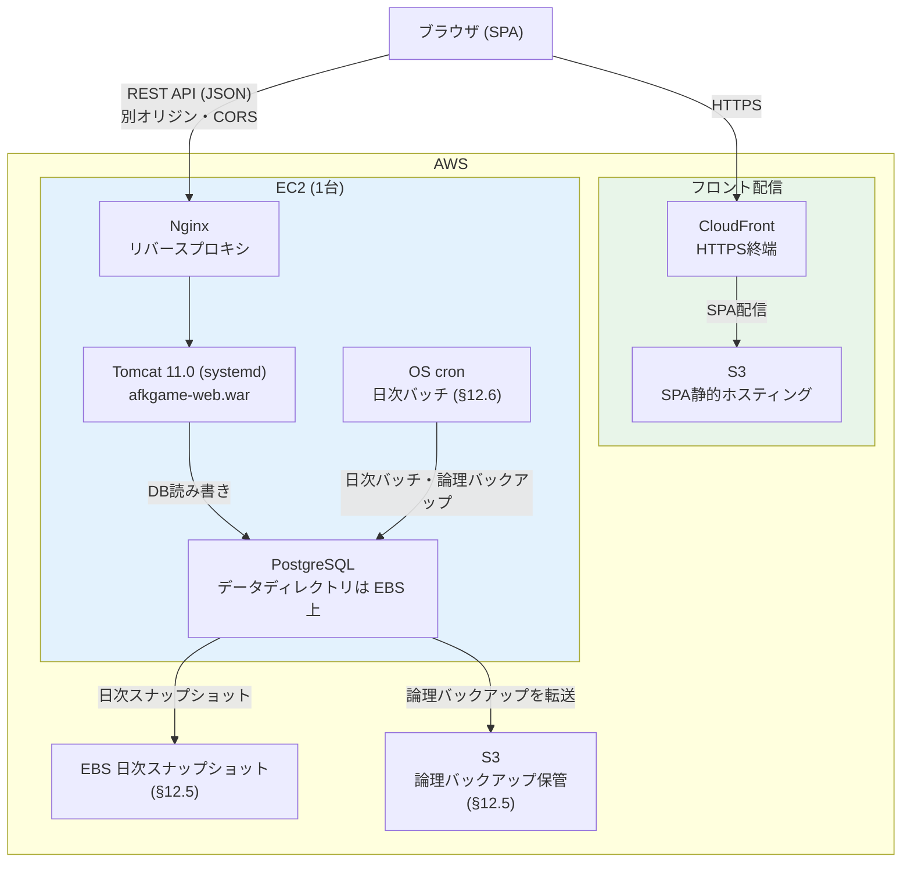

# システム構成図 — 本番構成（AWS）

> 親: [system_architecture.md](../system_architecture.md)。構成・数値・設定値は [tech_operations.md](../../tech/nonfunctional/tech_operations.md) §12.1〜§12.3 と [tech_operations_procedure.md](../../tech/nonfunctional/tech_operations_procedure.md) §12.4〜§12.7 が正（本図には再掲しない）。

## 本番構成（AWS）

- フロント（CloudFront）と API（EC2）は**別オリジン**。許可オリジンは [tech_operations.md](../../tech/nonfunctional/tech_operations.md) §12.2 の `CORS_ORIGINS` が正
- 復旧は論理バックアップを第一手段とし、ボリューム障害時にスナップショットから復元する（§12.5）
- マネージドコンテナ（App Runner・ECS Fargate）は採用しない（§12.1）
