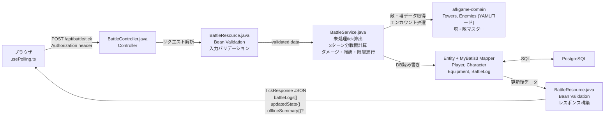

# システム構成図 — tick処理のデータフロー

> 親: [system_architecture.md](../system_architecture.md)。tick仕様は [tech_tick.md](../../tech/detail/tech_tick.md)、戦闘計算は [tech_battle.md](../../tech/detail/tech_battle.md)。

## tick処理のデータフロー

