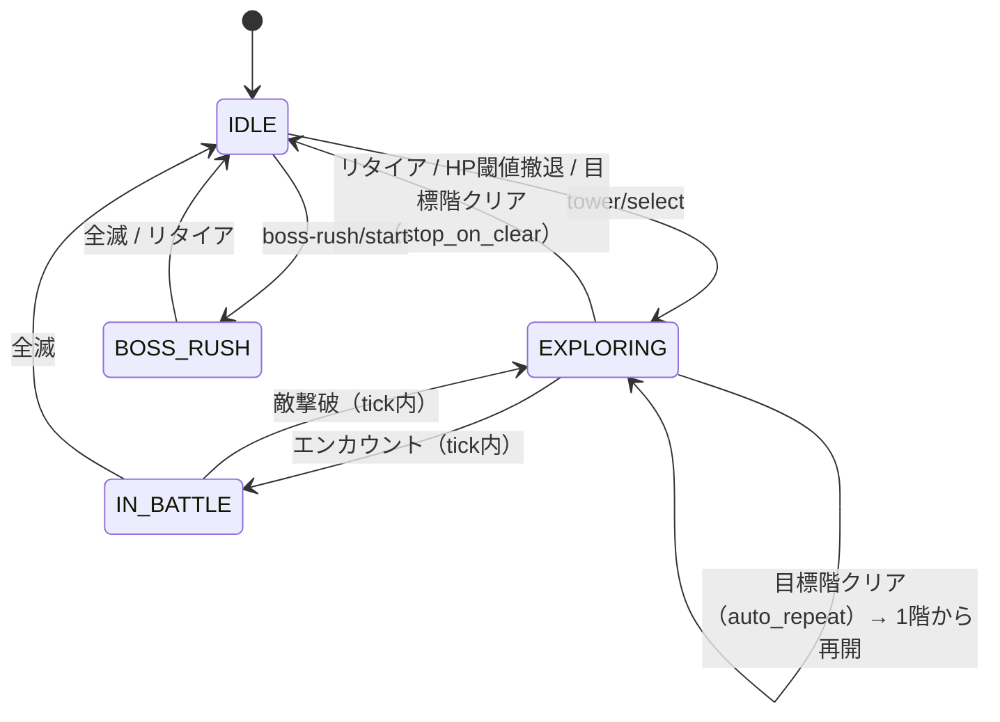

# AFK GAME — 進行状態と操作可否

> 技術仕様の索引は [tech_spec.md](tech_spec.md)。API一覧は [tech_api.md](tech_api.md)、戦闘・撤退のゲーム仕様は [battle.md](../design/systems/battle.md)、画面遷移は [screen_transition.md](../../diagrams/screen_transition.md)。
> 本書はプレイヤーの**進行状態**を状態機械として定義し、各状態で許可される操作とデータの不変条件を確定する。

---

## 1. 状態の定義

| 状態 | 判定条件 | 意味 |
|------|---------|------|
| `IDLE`（塔外待機） | `currentTowerId = null` | 塔に入っていない。HP自然回復のみ進行する |
| `EXPLORING`（探索中） | `currentTowerId ≠ null` かつ `currentEnemyId = null` | 入塔済み・エンカウント待ち |
| `IN_BATTLE`（戦闘中） | `currentTowerId ≠ null` かつ `currentEnemyId ≠ null` | 交戦中 |
| `BOSS_RUSH`（Phase 5〜） | `bossRush.active = true` | ボスラッシュ中。通常塔とは排他 |

- 状態は専用カラムを持たず、上表の条件から**導出**する（状態カラムと実データの二重管理を避ける）
- 「全滅」「目標階クリア」は状態ではなく**遷移イベント**。tick処理の中で発生し、同一tick内で次状態へ遷移する

### 1.1 不変条件

| 条件 | 内容 |
|------|------|
| 塔の対 | `currentTowerId` / `currentFloor` / `targetFloor` は同時にnull、または同時に非null |
| 敵の対 | `currentEnemyId` と `currentEnemyHp` は同時にnull、または同時に非null |
| 敵の従属 | `currentEnemyId ≠ null` ならば `currentTowerId ≠ null` |
| 階の範囲 | `1 ≤ currentFloor` かつ `targetFloor ≤ 塔の総階数` |
| 排他 | `bossRush.active = true` ならば `currentTowerId = null` |
| HP | 全キャラの `hp` は `0 ≤ hp ≤ effectiveMaxHp` |

- 不変条件違反はデータ不整合として ERRORログ + `500 INTERNAL_UNEXPECTED_ERROR` を返す（黙って補正しない）

## 2. 状態遷移



| 遷移 | 契機 | 後始末 |
|------|------|-------|
| 塔選択 | `POST /api/tower/select` | `currentFloor = 1`、敵情報をクリア、探索セッションを開始（§3） |
| 全滅 | パーティ全員HP=0 | 塔・敵情報をクリア。ペナルティ適用（§3）→ `IDLE`。自動周回でも再スタートしない |
| リタイア | `POST /api/tower/retire` | 現在の戦闘完了後に塔・敵情報をクリア。獲得済み報酬は保持 |
| HP閾値撤退 | 階クリア後にHPが閾値以下 | リタイアと同じ後始末（battle.md §撤退条件） |
| 目標階クリア（`stop_on_clear`） | `currentFloor > targetFloor` | 塔・敵情報をクリアし `IDLE` へ |
| 目標階クリア（`auto_repeat`） | 同上 | `currentFloor = 1` に戻し探索継続。探索セッションは継続する |

- リタイアは**現在の戦闘が完了した時点**で成立する。戦闘途中での即時中断は行わない（[battle.md](../design/systems/battle.md) §戦闘の流れ）

## 3. 探索セッション（run）

[battle.md §全滅時の処理](../design/systems/battle.md) のペナルティは「**今回の塔探索中に**取得したゴールド・アイテムをすべて失う」と定義されている。これを成立させるため、入塔から離脱までを1つの**探索セッション**として集計する。

| フィールド | 内容 |
|-----------|------|
| `runGold` | セッション中に獲得したゴールドの累計 |
| `runItems` | セッション中に獲得したアイテム（`itemId` → 個数） |
| `runEquipmentIds` | セッション中に獲得した装備のID一覧 |

| 契機 | 探索セッションの扱い |
|------|-------------------|
| 塔選択（入塔） | 全フィールドを0／空でリセット |
| 目標階クリア（`auto_repeat`） | **継続**（周回をまたいで累積する） |
| リタイア・HP閾値撤退・目標階クリア（`stop_on_clear`） | 確定（没収なし）してリセット |
| 全滅 | ペナルティを適用してリセット |

**全滅ペナルティの適用順序**:

```
1. runGold を所持ゴールドから減算（下限0）
2. runItems を所持アイテムから減算（下限0）
3. runEquipmentIds の装備を削除（装備中・ロック済みも対象）
4. 各キャラの現在レベル内の蓄積EXPを50%減算（レベルダウンしない）
5. 全キャラのHPを maxHP へ全回復
6. 塔・敵情報をクリアして IDLE へ
```

- 装備は「今回の探索中に取得したドロップアイテム」に含まれるものとして扱う（ロック済みでも没収対象。ロックは自動売却の除外用であり、全滅ペナルティの免除ではない）
- **HP全回復とする根拠**: battle.md のペナルティはEXP・ゴールド・アイテムの3項目に限定されている。HP0のまま `IDLE` にすると「自然回復を待つ時間」という第4のペナルティを暗黙に追加してしまうため、全回復とする
- 探索セッションはサーバー側で保持し、`GET /api/game/state` には含めない。全滅発生時のみ tickレスポンスに損失サマリーとして返す

## 4. 状態 × 操作の可否

| 操作 | `IDLE` | `EXPLORING` / `IN_BATTLE` | `BOSS_RUSH` |
|------|:------:|:------------------------:|:-----------:|
| `POST /api/tower/select` | ○ | ×（400 `TOWER_ALREADY_IN`） | × |
| `POST /api/tower/retire` | ×（400） | ○ | × |
| `PUT /api/tower/mode` | ×（400） | ○ | × |
| `PUT /api/tower/retreat-conditions` | ○ | ○ | × |
| `POST /api/equipment/equip` | ○ | ○ | ○ |
| `POST /api/equipment/sell` / `lock` | ○ | ○（ロック中・装備中は不可） | ○ |
| `PUT /api/party/edit` | ○ | ×（400 `PARTY_LOCKED_IN_TOWER`） | × |
| `POST /api/skill/learn` / `set-active` | ○ | ○ | ○ |
| `POST /api/character/limit-break` | ○ | ×（400） | × |
| `POST /api/prestige` | ○ | ×（400） | × |
| `POST /api/shop/buy` / `item/sell` | ○ | ○ | ○ |
| `POST /api/base/*` / `forge/*` | ○ | ○ | ○ |
| `POST /api/boss-rush/start` | ○ | ×（400） | × |

- **パーティ編成・限界突破・転生を探索中に禁止する根拠**: いずれも編成やステータスを不連続に変える操作で、探索セッション中に適用すると同一セッション内の期待被ダメージ計算（[tech_offline.md §4.1](tech_offline.md)）の前提が崩れるため
- 装備変更・スキルセットは探索中も許可する（放置ゲームの操作性を優先。次tickから反映）
- 塔選択の入塔前提: パーティに `hp > 0` のキャラが1体以上いること（全員HP0での入塔は `400`）

## 5. 分岐一覧（単体テスト観点）

| # | 分岐 | 期待結果 |
|---|------|---------|
| 1 | `IDLE` で `tower/retire` | `400` |
| 2 | `EXPLORING` で `tower/select` | `400 TOWER_ALREADY_IN` |
| 3 | 未解放の塔を選択 | `403 TOWER_NOT_UNLOCKED` |
| 4 | `targetFloor` が総階数超過 | `400 TOWER_INVALID_FLOOR` |
| 5 | `EXPLORING` で `party/edit` | `400 PARTY_LOCKED_IN_TOWER` |
| 6 | 全滅（`runGold=0` のとき） | ゴールド減算0・下限を割らない |
| 7 | 全滅（装備中の装備をrun中に取得） | 装備解除のうえ削除 |
| 8 | 全滅（EXP=0のキャラ） | EXP減算0 |
| 9 | 全滅後のHP | 全員 maxHP |
| 10 | `auto_repeat` で目標階クリア | `currentFloor=1`・探索セッション継続 |
| 11 | `stop_on_clear` で目標階クリア | `IDLE`・探索セッション確定 |
| 12 | 不変条件違反データ | `500 INTERNAL_UNEXPECTED_ERROR` + ERRORログ |

---

> 変更履歴は [tech_spec.md](tech_spec.md) を参照。
